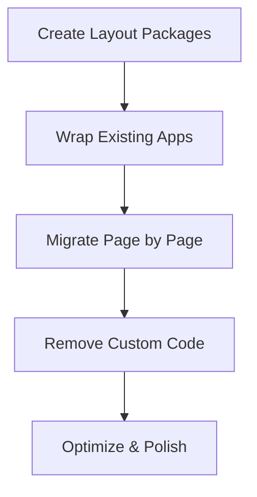

# 🔄 Layera Layout System - Migration Strategy

## 📋 Executive Summary

Αυτό το έγγραφο καθορίζει τη στρατηγική migration από την τρέχουσα custom layout approach στο unified **Layera Layout System**. Ο στόχος είναι να επιτύχουμε **100% consistency** σε όλες τις εφαρμογές χωρίς regressions.

## 🎯 Migration Goals

### Primary Objectives
- ✅ **Ενιαία UX** σε όλες τις Layera εφαρμογές
- ✅ **Μείωση κώδικα duplication** >50%
- ✅ **Improved maintainability** με centralized components
- ✅ **Better responsive behavior** σε όλες τις συσκευές
- ✅ **Faster development** για νέα features

### Secondary Objectives
- ✅ **Performance optimization** με shared components
- ✅ **Accessibility compliance** WCAG 2.1 AA
- ✅ **Design system scalability** για μελλοντικές εφαρμογές
- ✅ **Developer experience** improvement

## 🗺️ Current State Analysis

### Apps Inventory
```
layera/
├── apps/
│   ├── layera-id/           ❌ Custom dashboard layout
│   └── layera-geoalert/     ❌ Custom fullscreen layout
└── packages/
    ├── @layera/viewport/    ✅ Reusable utility
    ├── @layera/icons/       ✅ Reusable utility
    └── @layera/theme-*      ✅ Reusable utilities
```

### Layout Inconsistencies Identified
1. **Headers**: Κάθε app έχει διαφορετική header structure
2. **Navigation**: Ασυνεπή sidebar patterns
3. **Containers**: Διαφορετικά padding/spacing patterns
4. **Cards**: Custom card implementations χωρίς standards
5. **Responsive**: Ad-hoc responsive solutions

## 🏗️ Target Architecture

### New Package Structure
```
packages/
├── @layera/layout/          🆕 Core layout system
├── @layera/cards/           🆕 Standardized cards
├── @layera/patterns/        🆕 UI patterns
├── @layera/viewport/        ✅ Existing (enhanced)
├── @layera/icons/           ✅ Existing
└── @layera/theme-*          ✅ Existing
```

### Unified App Structure
```tsx
// ALL apps will follow this pattern:
<AppShell
  layout="dashboard|fullscreen|fullscreen-map"
  header={<LayeraHeader {...headerProps} />}
  sidebar={<AppNavigation />}
>
  <Routes>
    <Route path="/" element={
      <PageContainer>
        <PageHeader />
        <Content />
      </PageContainer>
    } />
  </Routes>
</AppShell>
```

## 📅 Migration Timeline

### Phase 1: Foundation (Week 1-2)
**Goal**: Create core layout infrastructure

#### Week 1: Package Setup
- [ ] Create `@layera/layout` package structure
- [ ] Implement `AppShell` component
- [ ] Implement `LayeraHeader` component
- [ ] Create design tokens system
- [ ] Setup build & documentation

#### Week 2: Core Components
- [ ] Implement `NavigationSidebar` component
- [ ] Implement `PageContainer` & `PageHeader`
- [ ] Create responsive utilities & hooks
- [ ] Add comprehensive testing
- [ ] Create Storybook documentation

### Phase 2: App Migration (Week 3-4)
**Goal**: Migrate existing apps to use layout system

#### Week 3: layera-geoalert Migration
- [ ] Install @layera/layout dependency
- [ ] Create GeoHeader component
- [ ] Wrap app με AppShell (fullscreen-map layout)
- [ ] Test responsive behavior
- [ ] Remove custom layout code

#### Week 4: layera-id Migration
- [ ] Create IdNavigation component
- [ ] Create IdHeaderActions component
- [ ] Migrate Dashboard page layout
- [ ] Migrate Account/Settings pages
- [ ] Migrate AdminRoles page

### Phase 3: Cards & Patterns (Week 5-6)
**Goal**: Standardize all UI patterns

#### Week 5: @layera/cards Package
- [ ] Create BaseCard component
- [ ] Implement InfoCard, DataCard, ActionCard variants
- [ ] Create DashboardCard για dashboard widgets
- [ ] Migrate existing cards to use new system

#### Week 6: @layera/patterns Package
- [ ] Create Form patterns (FormContainer, FormSection)
- [ ] Create Table patterns (DataTable, TableActions)
- [ ] Create Navigation patterns (TabContainer, Breadcrumbs)
- [ ] Migrate existing patterns

### Phase 4: Polish & Optimization (Week 7-8)
**Goal**: Optimize performance and user experience

#### Week 7: Performance & Testing
- [ ] Performance optimization (bundle size, tree-shaking)
- [ ] Comprehensive testing (unit, integration, visual)
- [ ] Accessibility audit & improvements
- [ ] Cross-browser testing

#### Week 8: Documentation & Launch
- [ ] Complete documentation update
- [ ] Create migration guides
- [ ] Developer training materials
- [ ] Production deployment

## 🔧 Technical Migration Strategy

### 1. Gradual Migration Approach


### 2. Backward Compatibility
- Maintain existing functionality κατά τη migration
- Gradual removal of custom code
- Feature flags για smooth transitions

### 3. Testing Strategy
```typescript
// Migration testing checklist
const migrationTests = {
  functionality: [
    'All existing features work',
    'Navigation flows intact',
    'Forms submit correctly',
    'Data displays properly'
  ],
  layout: [
    'Responsive breakpoints work',
    'Header/sidebar behavior correct',
    'Containers size properly',
    'Spacing/padding consistent'
  ],
  performance: [
    'Page load times maintained',
    'Bundle sizes optimized',
    'No memory leaks',
    'Smooth animations'
  ]
};
```

### 4. Risk Mitigation
```typescript
interface MigrationRisk {
  risk: string;
  impact: 'low' | 'medium' | 'high';
  mitigation: string;
}

const migrationRisks: MigrationRisk[] = [
  {
    risk: 'Breaking existing functionality',
    impact: 'high',
    mitigation: 'Gradual migration + comprehensive testing'
  },
  {
    risk: 'Performance regressions',
    impact: 'medium',
    mitigation: 'Performance monitoring + optimization'
  },
  {
    risk: 'CSS conflicts',
    impact: 'medium',
    mitigation: 'CSS modules + scoped styling'
  },
  {
    risk: 'User experience disruption',
    impact: 'low',
    mitigation: 'Maintain visual consistency + user testing'
  }
];
```

## 📊 Success Metrics

### Quantitative Metrics
- **Code Reduction**: >50% reduction σε layout-related code
- **Bundle Size**: <10% increase στο total bundle size
- **Performance**: No degradation σε page load times
- **Test Coverage**: >90% coverage για layout components
- **Accessibility**: 100% WCAG 2.1 AA compliance

### Qualitative Metrics
- **Developer Experience**: Faster development για νέα features
- **Design Consistency**: Visual audit shows 100% consistency
- **User Experience**: User testing shows no usability regressions
- **Maintainability**: Code review shows improved structure

## 🚨 Rollback Strategy

### Rollback Triggers
- Performance degradation >20%
- Critical functionality broken
- User experience significantly impacted
- Timeline delays >2 weeks

### Rollback Process
1. **Immediate**: Revert to previous commit
2. **Short-term**: Disable layout system με feature flags
3. **Analysis**: Identify root cause of issues
4. **Fix**: Address problems και retry migration
5. **Communication**: Update stakeholders on status

## 👥 Team Responsibilities

### Development Team
- Package implementation
- App migration execution
- Testing & quality assurance
- Performance optimization

### Design Team
- Design system validation
- Visual consistency review
- User experience testing
- Accessibility compliance

### Product Team
- Migration planning & prioritization
- Stakeholder communication
- Success metrics tracking
- User feedback collection

## 📚 Documentation Requirements

### Developer Documentation
- [ ] Component API documentation
- [ ] Migration guides per app
- [ ] Best practices guide
- [ ] Troubleshooting guide

### Design Documentation
- [ ] Design tokens reference
- [ ] Component guidelines
- [ ] Layout patterns guide
- [ ] Responsive behavior spec

### User Documentation
- [ ] Feature change notifications
- [ ] User guide updates
- [ ] FAQ για νέα interface
- [ ] Accessibility features guide

## 🔍 Post-Migration Tasks

### Immediate (Week 9)
- [ ] Performance monitoring setup
- [ ] User feedback collection
- [ ] Bug tracking & resolution
- [ ] Documentation updates

### Short-term (Month 2)
- [ ] User behavior analysis
- [ ] Performance optimization
- [ ] Feature usage analytics
- [ ] Developer satisfaction survey

### Long-term (Months 3-6)
- [ ] Layout system evolution
- [ ] New component additions
- [ ] Performance optimizations
- [ ] Best practices refinement

## ✅ Go/No-Go Criteria

### GO Criteria
- [ ] All packages pass comprehensive testing
- [ ] Performance benchmarks met
- [ ] Accessibility compliance verified
- [ ] Stakeholder approval received
- [ ] Rollback strategy tested

### NO-GO Criteria
- [ ] Critical bugs remain unresolved
- [ ] Performance regressions >10%
- [ ] Accessibility failures exist
- [ ] Testing coverage <80%
- [ ] Team readiness insufficient

---

**Αυτή η στρατηγική θα καθοδηγήσει την ολοκληρωμένη migration στο Layera Layout System.**