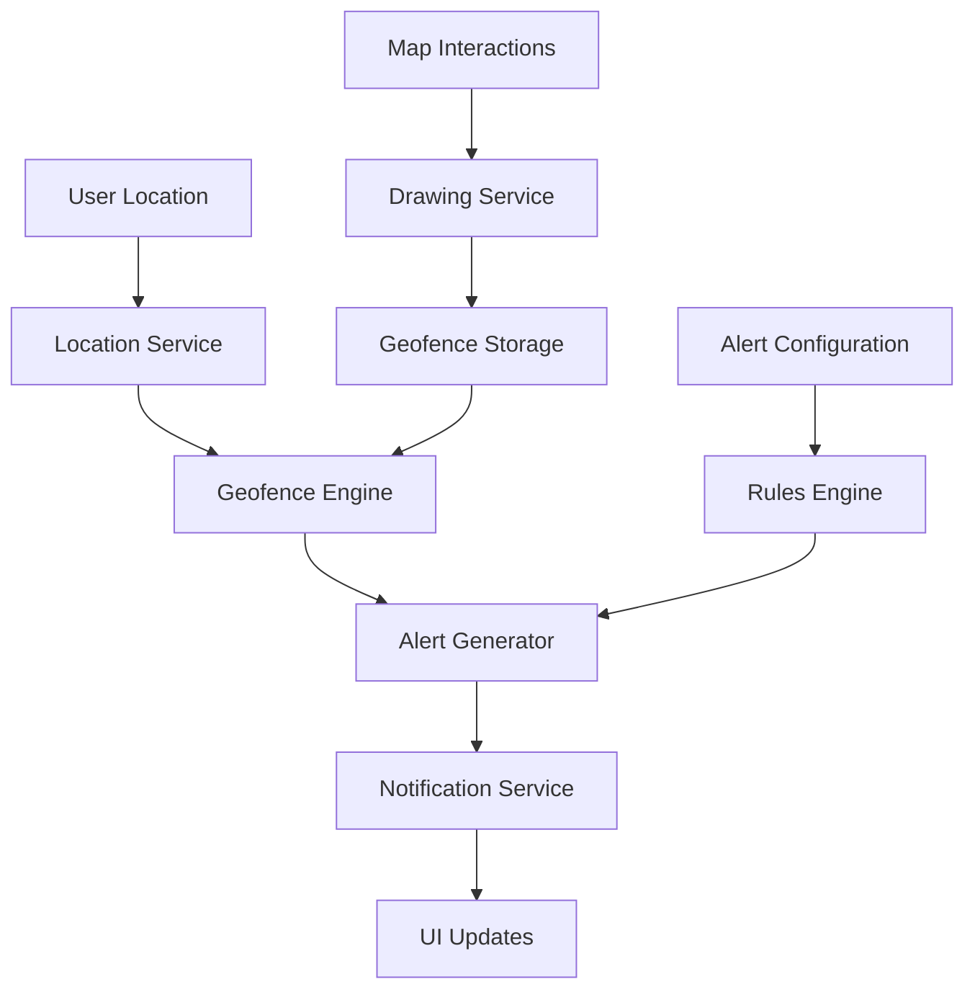

# 🗺️ LayeraGeoAlert Architecture Documentation

## 📋 Application Overview

LayeraGeoAlert is the geospatial alerting and monitoring application of the Layera enterprise platform, providing location-based alerts, emergency notifications, and geographic data visualization.

## 🏗️ Architecture

### Tech Stack
- **Frontend**: React 18 + Vite
- **Mapping**: Leaflet + React-Leaflet
- **Geospatial**: GeoJSON, Turf.js for spatial calculations
- **Authentication**: @layera/auth-bridge integration
- **Styling**: @layera design system packages
- **Real-time**: WebSocket connections for live alerts
- **Internationalization**: @layera/i18n (Greek/English)

### Application Structure
```
src/
├── components/          # Reusable UI components
│   ├── Map/            # Map-related components
│   │   ├── MapContainer.jsx
│   │   ├── AlertLayer.jsx
│   │   ├── UserLocationLayer.jsx
│   │   └── GeofenceLayer.jsx
│   ├── Alerts/         # Alert management
│   │   ├── AlertCard.jsx
│   │   ├── AlertForm.jsx
│   │   ├── AlertHistory.jsx
│   │   └── AlertSettings.jsx
│   ├── Geofences/      # Geofence management
│   │   ├── GeofenceEditor.jsx
│   │   ├── GeofenceList.jsx
│   │   └── GeofenceProperties.jsx
│   └── Dashboard/      # Dashboard components
│       ├── AlertMetrics.jsx
│       ├── ActivityFeed.jsx
│       └── QuickActions.jsx
├── pages/              # Full page components
│   ├── Dashboard.jsx   # Main dashboard
│   ├── MapView.jsx     # Full-screen map
│   ├── Alerts.jsx      # Alert management
│   ├── Geofences.jsx   # Geofence management
│   ├── Analytics.jsx   # Reporting and analytics
│   └── Settings.jsx    # Application settings
├── services/           # External service integrations
│   ├── geolocation.js  # Browser geolocation API
│   ├── websocket.js    # Real-time alert service
│   ├── geocoding.js    # Address ↔ coordinates conversion
│   └── notifications.js # Browser/push notifications
├── utils/              # Utility functions
│   ├── geomath.js      # Geospatial calculations
│   ├── alertTypes.js   # Alert type definitions
│   └── mapHelpers.js   # Map utility functions
├── styles/             # Global styles and themes
├── App.jsx            # Main application component
└── main.jsx           # Application entry point
```

## 🗺️ Geospatial Features

### Core Functionality

#### Alert System
- **Point Alerts**: Location-based notifications
- **Area Alerts**: Geofence entry/exit alerts
- **Proximity Alerts**: Distance-based triggers
- **Emergency Broadcasts**: Organization-wide alerts

#### Geofence Management
- **Create Geofences**: Draw polygons, circles, and custom shapes
- **Edit Geofences**: Modify existing boundaries
- **Geofence Properties**: Name, description, alert rules
- **Import/Export**: GeoJSON support for bulk operations

#### Real-time Monitoring
- **Live User Tracking**: Real-time location updates
- **Alert Processing**: Immediate geofence violation detection
- **Status Dashboard**: Current alert status and metrics
- **Activity Feed**: Recent alerts and system events

### Geographic Data Types

#### Supported Formats
- **GeoJSON**: Primary format for geographic data
- **GPX**: GPS track import/export
- **KML**: Google Earth compatibility
- **Shapefile**: Enterprise GIS integration

#### Coordinate Systems
- **WGS84 (EPSG:4326)**: Primary coordinate system
- **Web Mercator (EPSG:3857)**: Map display projection
- **Local Grid Systems**: Country-specific projections

## 🔄 Real-time Architecture

### WebSocket Integration
```javascript
// Alert stream subscription
const alertStream = new WebSocket('wss://api.layera.com/alerts');

alertStream.onmessage = (event) => {
  const alert = JSON.parse(event.data);
  handleIncomingAlert(alert);
};
```

### Alert Processing Pipeline
1. **Location Update** → User location changes
2. **Geofence Check** → Spatial query against active geofences
3. **Rule Evaluation** → Check alert conditions and rules
4. **Alert Generation** → Create alert if conditions met
5. **Notification Dispatch** → Send to relevant users
6. **Activity Logging** → Record for audit and analytics

### Performance Optimization
- **Spatial Indexing**: R-tree for efficient geofence queries
- **Location Throttling**: Configurable update intervals
- **Batch Processing**: Group multiple location updates
- **Caching**: Geofence data caching for offline operation

## 🎨 Design System Integration

### Planned Migration to @layera Design System

Currently using custom components, planning migration:

#### Phase 1: Layout Migration
- **AppShell**: Replace custom layout with unified header
- **NavigationSidebar**: Map-specific navigation menu
- **PageContainer**: Responsive content areas

#### Phase 2: UI Component Migration
- **@layera/forms**: Alert form, geofence properties
- **@layera/tables**: Alert history, user management
- **@layera/cards**: Dashboard metrics, alert cards

#### Phase 3: Map-Specific Components
- **MapControls**: Custom map interaction controls
- **AlertToasts**: Real-time alert notifications
- **GeospatialForms**: Location input, coordinate picker

### Custom Components (Map-Specific)
These will remain custom but follow design system patterns:

- **MapContainer**: Leaflet integration
- **DrawingTools**: Geofence creation tools
- **LocationPicker**: Interactive coordinate selection
- **DistanceMeasurement**: Spatial measurement tools

## 📊 Data Flow Architecture

### State Management


### Data Sources
- **User Devices**: GPS location data
- **External APIs**: Weather, traffic, emergency services
- **Manual Input**: Admin-created alerts and geofences
- **Integration APIs**: Third-party monitoring systems

## 🚀 Development Roadmap

### Phase 1: Foundation (High Priority)
1. **Design System Migration**
   - Convert to @layera layout system
   - Implement consistent navigation
   - Add theme support

2. **Authentication Integration**
   - Connect with LayeraID
   - Role-based map access
   - Organization-based geofences

### Phase 2: Enterprise Features (Medium Priority)
3. **Advanced Alert Rules**
   - Time-based conditions
   - Weather integration
   - Cascading alert chains

4. **Analytics Dashboard**
   - Alert frequency metrics
   - User activity patterns
   - Geofence effectiveness

### Phase 3: Advanced Features (Lower Priority)
5. **Mobile Application**
   - React Native companion app
   - Offline capability
   - Background location tracking

6. **Enterprise Integration**
   - LDAP/Active Directory sync
   - SMS/Email gateways
   - Third-party GIS systems

## 🔧 Technical Considerations

### Performance Requirements
- **Map Rendering**: Smooth interaction at all zoom levels
- **Real-time Updates**: <1 second alert delivery
- **Concurrent Users**: Support 1000+ simultaneous users
- **Data Volume**: Handle millions of location points

### Scalability Architecture
- **Microservices**: Separate services for location, alerts, notifications
- **Load Balancing**: Distribute WebSocket connections
- **Database Optimization**: Spatial indexing and clustering
- **CDN Integration**: Map tiles and static assets

### Security & Privacy
- **Location Privacy**: User consent and data anonymization
- **Secure Communication**: HTTPS/WSS for all connections
- **Access Control**: Role-based geofence visibility
- **Audit Trail**: Location access and alert generation logs

## 📱 Mobile Considerations

### Responsive Design
- **Mobile-First**: Touch-friendly map controls
- **Responsive Layout**: Sidebar collapse on mobile
- **Gesture Support**: Pinch/zoom, pan, rotate

### Progressive Web App (PWA)
- **Service Worker**: Offline map caching
- **Push Notifications**: Background alert delivery
- **App Install**: Add to home screen capability
- **Background Sync**: Queue location updates when offline

---

**Last Updated**: October 2024
**Owner**: LayeraGeoAlert Development Team
**Status**: Planning Phase