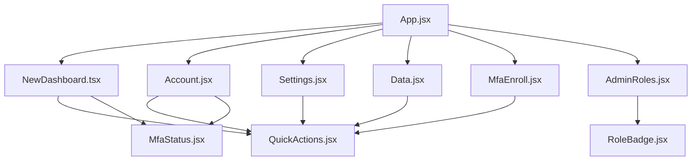

# 🏢 LayeraID Architecture Documentation

---

## 📚 **RELATED DOCUMENTATION NAVIGATION**

### **🧩 Core Architecture Series:**
- **[📊 Pipeline Architecture](../../docs/pipeline-architecture/01-CURRENT-STATE-ANALYSIS.md)** - System Analysis & LEGO Readiness
- **[🗺️ Geo-Drawing Architecture](../../docs/geo-drawing-architecture/01-CURRENT-STATE-ANALYSIS.md)** - Geo-spatial Systems Analysis
- **[🏗️ Core Systems](../../docs/core-systems/LEGO_SYSTEMS_ANALYSIS.md)** - Component Architecture Analysis

### **📱 Application Docs:**
- **[📖 ID App README](./README.md)** - Identity Service Overview
- **[📐 ID Layout Migration Plan](./docs/LAYOUT_MIGRATION_PLAN.md)** - Layout Migration Strategy

### **🗺️ Related App Documentation:**
- **[🗺️ GeoAlert Architecture](../layera-geoalert/ARCHITECTURE.md)** - GeoAlert Application Architecture

### **📚 Master Documentation:**
- **[📚 Documentation Index](../../docs/meta/DOCUMENTATION_INDEX.md)** - Complete Documentation Navigation (84 files)
- **[🎯 Strategic Documents](../../strategy/LAYERA_CORE_STRATEGY.md)** - Business Architecture & Dual Categories

---

## 📋 Application Overview

LayeraID is the core identity management application of the Layera enterprise platform, providing authentication, user management, and access control functionality.

## 🏗️ Architecture

### Tech Stack
- **Frontend**: React 18 + Vite
- **Authentication**: Firebase Auth + Custom Claims
- **Styling**: @layera design system packages
- **Routing**: React Router v6
- **Internationalization**: @layera/tolgee (Greek/English)
- **State Management**: React Context + Firebase

### Application Structure
```
src/
├── components/          # Reusable UI components
│   ├── icons/          # LayeraIcons SVG components
│   ├── Auth.jsx        # Authentication form
│   ├── Dashboard.jsx   # Legacy dashboard (to be removed)
│   ├── NewDashboard.tsx # Modern dashboard with design system
│   ├── MfaEnroll.jsx   # MFA enrollment flow
│   ├── MfaStatus.jsx   # MFA status display
│   ├── RoleBadge.jsx   # User role indicator
│   ├── Support.css     # Support styling
│   └── QuickActions.jsx # Shared navigation component
├── pages/              # Full page components
│   ├── Account.jsx     # User account management
│   ├── Settings.jsx    # Application settings
│   ├── Data.jsx        # User data export/privacy
│   └── AdminRoles.jsx  # Admin role management
├── styles/             # Global styles and themes
├── firebase.js         # Firebase configuration
├── App.jsx            # Main application component
└── main.jsx           # Application entry point
```

## 🔐 Authentication Flow

### Firebase Integration
```javascript
// Custom claims structure
{
  role: 'admin' | 'editor' | 'viewer' | 'private',
  mfa_verified: boolean,
  permissions: string[],
  organization_id: string
}
```

### Authentication States
1. **Unauthenticated** → Login/Register page
2. **Authenticated** → Dashboard with role-based access
3. **MFA Required** → MFA enrollment flow
4. **Admin Access** → Additional admin pages

### Role-Based Access Control
- **Private**: Basic dashboard access
- **Viewer**: Read-only enterprise features
- **Editor**: Create/edit permissions
- **Admin**: Full system administration

## 🎨 Design System Integration

### Current Implementation
All pages now use the @layera design system:

#### Layout Components
- **AppShell**: Main application container
- **LayeraHeader**: Unified header with branding
- **PageContainer**: Responsive content container
- **PageHeader**: Page title and subtitle

#### UI Components
- **DashboardSection**: Content sections with icons
- **DashboardCard**: Consistent card layouts
- **DashboardGrid**: Responsive grid system
- **Button**: Standardized button components

#### Navigation
- **QuickActions**: Shared navigation component used across all pages
- **HeaderActionsGroup**: Header actions (theme, language, user menu)

### Migration Status
- ✅ **Dashboard**: Fully migrated to NewDashboard.tsx
- ✅ **Account**: Using design system layout
- ✅ **Settings**: Using design system layout
- ✅ **Data**: Using design system layout
- ✅ **MFA Enroll**: Recently migrated to design system
- ⚠️ **AdminRoles**: Partially migrated, needs @layera/forms

## 📊 Component Dependencies

### Internal Dependencies


### Package Dependencies
- **@layera/auth-bridge**: User authentication and context
- **@layera/layout**: AppShell, headers, containers
- **@layera/cards**: Dashboard sections and cards
- **@layera/buttons**: All button interactions
- **@layera/theme-switcher**: Dark/light theme toggle
- **@layera/tolgee**: Greek/English translations

## 🚀 Planned Improvements

### Phase 1: Forms & Admin (High Priority)
1. **AdminRoles Migration**
   - Replace native inputs with @layera/forms
   - Add proper validation and error handling
   - Implement loading states

2. **User Management Enhancement**
   - Add @layera/tables for user lists
   - Implement bulk actions
   - Add user search and filtering

### Phase 2: Enterprise Features (Medium Priority)
3. **Audit Trail**
   - User activity logging
   - Admin action tracking
   - Security event monitoring

4. **Advanced Settings**
   - Organization configuration
   - Security policies
   - Integration settings

### Phase 3: Advanced Features (Low Priority)
5. **Reporting Dashboard**
   - User analytics
   - Security metrics
   - Usage reports

6. **Help & Onboarding**
   - In-app help system
   - User onboarding flow
   - Admin training materials

## 🔧 Development Guidelines

### Component Standards
- **No custom CSS** - Use design system components only
- **TypeScript migration** - Convert .jsx to .tsx gradually
- **Accessibility** - ARIA labels and keyboard navigation
- **Responsive design** - Mobile-first approach

### Code Organization
- **Shared components** in `/components`
- **Page components** in `/pages`
- **Utility functions** in `/utils` (to be created)
- **Types** in `/types` (to be created)

### Testing Strategy
- **Component tests** for all UI components
- **Integration tests** for authentication flows
- **E2E tests** for critical user journeys
- **Accessibility tests** for all pages

## 📈 Performance Considerations

### Current Optimizations
- **Code splitting** with React.lazy
- **Asset optimization** with Vite
- **Design system** reduces bundle size through shared components

### Planned Optimizations
- **Route-based code splitting** for admin features
- **Image optimization** for user avatars
- **Service worker** for offline functionality
- **Performance monitoring** with real user metrics

## 🔒 Security Considerations

### Current Security
- **Firebase Auth** with secure token management
- **Role-based access** control in UI
- **HTTPS only** in production
- **XSS protection** with React's built-in escaping

### Security Roadmap
- **Content Security Policy** implementation
- **Rate limiting** for sensitive operations
- **Audit logging** for all admin actions
- **Session management** improvements

---

**Last Updated**: October 2024
**Owner**: LayeraID Development Team
**Status**: Active Development