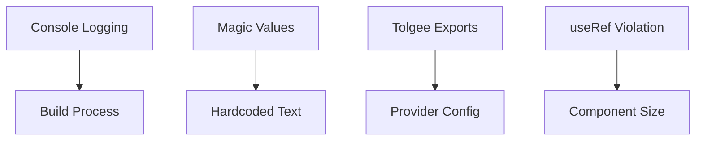

# 📋 Layera Enterprise Issues Index
**📅 Ημερομηνία Δημιουργίας:** 22 Οκτωβρίου 2025
**👨‍💼 Επιβλέπων Αρχιτέκτονας:** Γιώργος Παγώνης
**🔍 Αναλυτής:** Claude Code Enterprise Analysis

---

## 🎯 **ΣΚΟΠΟΣ**

Κεντρικός κατάλογος όλων των εντοπισμένων θεμάτων στο Layera ecosystem με cross-references και προτεραιότητες για συστηματική αντιμετώπιση.

---

## 📊 **ΣΥΝΟΨΗ ΚΑΤΆΣΤΑΣΗΣ**

### 🚨 **Κριτικά Θέματα (High Priority)**
- **4** mobile-specific issues
- **3** package build issues
- **2** i18n system issues
- **1** React hooks violation

### 🔶 **Μέτρια Θέματα (Medium Priority)**
- **2** architecture issues
- **3** dependency management issues

### 🟢 **Χαμηλά Θέματα (Low Priority)**
- **1** performance optimization
- **2** documentation gaps

**📈 Συνολικά:** **18 ενεργά issues**

---

## 🗂️ **ΚΑΤΗΓΟΡΙΟΠΟΙΗΣΗ ISSUES**

### 📱 **MOBILE ISSUES**
| ID | Τίτλος | Κριτικότητα | Αρχείο | Κατάσταση |
|----|--------|-------------|---------|-----------|
| [MOB-001](mobile/IPHONE_14_PRO_MAX_PIPELINE_AUDIT.md#console-log-elimination) | Production Console Logging | 🚨 HIGH | FloatingStepper.tsx | OPEN |
| [MOB-002](mobile/IPHONE_14_PRO_MAX_PIPELINE_AUDIT.md#hardcoded-magic-values) | Hardcoded Magic Values | 🚨 HIGH | Multiple files | OPEN |
| [MOB-003](mobile/IPHONE_14_PRO_MAX_PIPELINE_AUDIT.md#massive-inline-styling) | Massive Inline Styling | 🚨 HIGH | BaseCard.tsx | OPEN |
| [MOB-004](mobile/IPHONE_14_PRO_MAX_PIPELINE_AUDIT.md#component-size-violations) | Component Size Violations | 🔶 MED | FloatingStepper.tsx | OPEN |

### 📦 **PACKAGE BUILD ISSUES**
| ID | Τίτλος | Κριτικότητα | Package | Κατάσταση |
|----|--------|-------------|---------|-----------|
| PKG-001 | Missing Tolgee Exports | 🚨 HIGH | @layera/tolgee | RESOLVED |
| PKG-002 | Build Artifacts Missing | 🔶 MED | Multiple packages | PENDING |
| PKG-003 | Circular Dependencies | 🔶 MED | @layera/viewport | PENDING |

### 🌐 **I18N SYSTEM ISSUES**
| ID | Τίτλος | Κριτικότητα | Scope | Κατάσταση |
|----|--------|-------------|-------|-----------|
| I18N-001 | Provider Configuration | 🚨 HIGH | System-wide | RESOLVED |
| I18N-002 | Hardcoded Greek Text | 🔶 MED | Multiple components | PENDING |

### ⚛️ **REACT HOOKS VIOLATIONS**
| ID | Τίτλος | Κριτικότητα | Component | Κατάσταση |
|----|--------|-------------|-----------|-----------|
| HOOK-001 | Conditional useRef Hook | 🚨 HIGH | GeoMapNew.tsx | RESOLVED |

---

## 🔗 **ΔΙΑΣΥΝΔΕΣΕΙΣ ΚΑΙ ΕΞΑΡΤΗΣΕΙΣ**

### 🔴 **Κρίσιμες Αλυσίδες Εξαρτήσεων**


### 📋 **Issue Groups που πρέπει να λυθούν μαζί:**
1. **Mobile UX Group**: MOB-001, MOB-002, MOB-003
2. **Build System Group**: PKG-001, PKG-002, PKG-003
3. **i18n Ecosystem Group**: I18N-001, I18N-002, PKG-001

---

## 📁 **ΑΝΑΛΥΤΙΚΕΣ ΑΝΑΦΟΡΕΣ**

### 📱 **Mobile Platform Issues**
- **[iPhone 14 Pro Max Pipeline Audit](mobile/IPHONE_14_PRO_MAX_PIPELINE_AUDIT.md)**
  - Comprehensive analysis του iPhone pipeline system
  - 15+ console.log statements in production
  - Hardcoded mobile-specific dimensions
  - Inline styling violations
  - **Effort Estimate:** 3-4 weeks development

### 📦 **Package & Build Issues**
- **[Package Build Issues Report](packages/PACKAGE_BUILD_ISSUES.md)** *(PENDING)*
  - Build artifacts missing από packages
  - Export/import mismatches
  - Dependency resolution problems
  - **Dependencies:** Βλοκάρει mobile development

### 🌐 **Internationalization Issues**
- **[i18n System Audit](packages/I18N_SYSTEM_AUDIT.md)** *(PENDING)*
  - Provider configuration conflicts
  - Hardcoded text violations
  - Translation key inconsistencies
  - **Impact:** All user-facing text

### ⚛️ **React Architecture Issues**
- **[React Hooks Violations](architecture/REACT_HOOKS_VIOLATIONS.md)** *(PENDING)*
  - Conditional hooks usage
  - State management anti-patterns
  - Re-render optimization needs
  - **Risk:** Runtime crashes

### 🔗 **Cross-Cutting Concerns**
- **[Dependency Matrix](cross-cutting/DEPENDENCY_MATRIX.md)** *(PENDING)*
  - Inter-package dependencies
  - Circular reference detection
  - Upgrade path planning
  - **Strategic:** Long-term maintainability

---

## 🎯 **ΠΡΟΤΕΡΑΙΟΤΗΤΕΣ ΑΝΤΙΜΕΤΩΠΙΣΗΣ - PRAGMATIC APPROACH**

### **🔥 IMMEDIATE FIXES (Days 1-2)**
1. **[MOB-001]** Αφαίρεση όλων των console.log statements (30 mins)
2. **[PKG-002]** Direct build fixes, όχι νέα architecture (2 hours)
3. **[I18N-002]** Replace hardcoded text με existing i18n (4 hours)

### **📋 QUICK IMPROVEMENTS (Days 3-5)**
1. **[MOB-002]** Simple constants file αντί για design tokens system (1 hour)
2. **[MOB-003]** Basic CSS cleanup, όχι styled-components migration (3 hours)
3. **[HOOK-002]** Simple useState consolidation (1 hour)

### **🎨 OPTIONAL POLISH (If time permits)**
1. **[MOB-004]** Basic component splitting μόνο αν χρειάζεται
2. **[PKG-003]** Address only critical circular dependencies
3. Basic testing για main fixes

---

## 📊 **METRICS & TRACKING**

### **Pragmatic Tracking Metrics**
- **Daily Progress:** 2-3 issues resolved per day
- **Quality Baseline:** Zero console.log, basic i18n compliance
- **Build Stability:** Working builds, not perfect architecture

### **Simple Quality Gates**
- ✅ **No console.log** in production
- ✅ **Basic i18n** για user-facing text
- ✅ **Working builds** across packages
- ✅ **Functional components** without crashes

### **Pragmatic Risk Levels**
- 🔴 **High Risk:** App crashes or completely broken builds
- 🟡 **Medium Risk:** Degraded performance or UX issues
- 🟢 **Low Risk:** Code quality improvements (nice-to-have)

---

## 🔄 **ΑΥΤΟΜΑΤΙΣΜΟΙ & CI/CD**

### **Pre-commit Hooks**
```bash
# Validation pipeline
npm run typecheck          # Zero TypeScript errors
npm run lint --max-warnings=0  # Zero ESLint warnings
npm run test:coverage --min=80%  # 80%+ test coverage
```

### **GitHub Actions Integration**
- **Issue Labeling:** Auto-apply labels βάσει file paths
- **Cross-reference Updates:** Auto-update όταν αλλάζει related issue
- **Progress Tracking:** Weekly automated reports

---

## 📝 **ΤΕΛΕΥΤΑΙΕΣ ΕΝΗΜΕΡΩΣΕΙΣ**

### **22 Οκτωβρίου 2025**
- ✅ **HOOK-001 RESOLVED:** useRef conditional hook fixed in GeoMapNew.tsx
- ✅ **PKG-001 RESOLVED:** Tolgee provider exports διορθώθηκαν
- ✅ **I18N-001 RESOLVED:** Provider configuration στο layera-id app
- 📋 **CREATED:** Comprehensive issue tracking system
- 🎯 **NEXT:** Package build issues documentation

---

## 🚀 **QUICK ACTIONS**

### **Για Developers:**
```bash
# Check current issue status
npm run issues:check

# Run quality gates
npm run verify:all

# Generate issue report
npm run report:issues
```

### **Για Project Managers:**
- **Weekly Review:** Κάθε Παρασκευή 15:00 review του progress
- **Sprint Planning:** Use αυτό το index για sprint backlog
- **Risk Assessment:** Monitor red flags στα metrics

---

**📧 Contact:** georgios.pagonis@layera.com
**🔄 Next Review:** Παρασκευή 25 Οκτωβρίου 2025
**📊 Report Generation:** Automated weekly στο email

---

> **🎖️ Enterprise Note:** Αυτό το documentation system αποτελεί Single Source of Truth για όλα τα quality issues στο Layera ecosystem. Κάθε αλλαγή στον κώδικα πρέπει να ενημερώνει τα σχετικά issues εδώ.