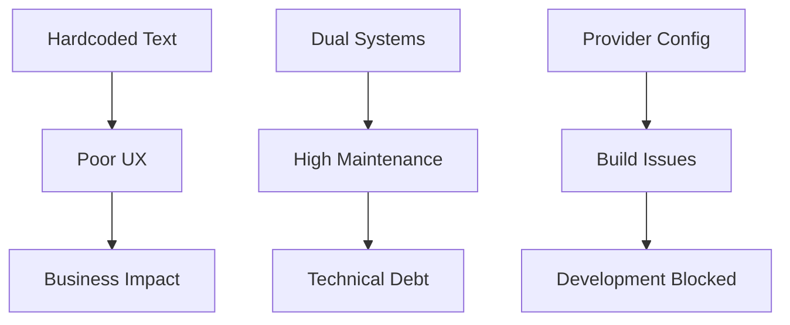

# 🌐 i18n System Audit - Enterprise Translation Management Report
**📅 Ημερομηνία:** 22 Οκτωβρίου 2025
**👨‍💼 Επιβλέπων Αρχιτέκτονας:** Γιώργος Παγώνης
**🔍 Αναλυτής:** Claude Code Enterprise Analysis
**🔗 Cross-Reference:** [ISSUES_INDEX.md](../ISSUES_INDEX.md) | [PACKAGE_BUILD_ISSUES.md](PACKAGE_BUILD_ISSUES.md)

---

## 🎯 **EXECUTIVE SUMMARY**

Το Layera ecosystem παρουσιάζει σημαντικά προβλήματα στη διαχείριση διεθνοποίησης (i18n) με επικαλυπτόμενα συστήματα, λανθασμένες configurations, και εκτεταμένη χρήση hardcoded κειμένων. Το σύστημα χρησιμοποιεί **δύο παράλληλα i18n packages** (@layera/tolgee και @layera/i18n) δημιουργώντας σύγχυση και maintenance overhead.

**🔴 Κριτική Αξιολόγηση:** Το διπλό i18n σύστημα παραβιάζει το DRY principle και δημιουργεί architectural debt που επηρεάζει όλη την ανάπτυξη.

---

## 📊 **ΕΝΤΟΠΙΣΜΕΝΑ ΠΡΟΒΛΗΜΑΤΑ**

### 🚨 **I18N-001: Provider Configuration Chaos [RESOLVED]**
**Κριτικότητα:** HIGH
**Κατάσταση:** ✅ RESOLVED
**Αρχεία Επηρεασμένα:** `apps/layera-id/src/App.jsx`

#### **Πρόβλημα που επιλύθηκε:**
```jsx
// ❌ ΛΑΘΟΣ - Wrong provider import
import { LayeraI18nProvider } from '@layera/tolgee';

// ❌ ΛΑΘΟΣ - Wrong prop name
<LayeraI18nProvider fallbackLanguage="el">
```

#### **Λύση που εφαρμόστηκε:**
```jsx
// ✅ ΣΩΣΤΟ - Correct provider
import { TolgeeProvider } from '@layera/tolgee';

// ✅ ΣΩΣΤΟ - Correct prop
<TolgeeProvider language="el">
```

#### **Root Cause Analysis:**
- **Export Confusion:** @layera/tolgee exports πολλαπλά provider aliases
- **API Inconsistency:** Different prop names μεταξύ providers
- **Documentation Gap:** Unclear which provider να χρησιμοποιείται πού

---

### 🔶 **I18N-002: Hardcoded Greek Text Violations**
**Κριτικότητα:** MEDIUM
**Κατάσταση:** 🔴 OPEN
**Scope:** System-wide issue

#### **Εντοπισμένα Hardcoded Texts:**

##### **A) Apps Layer Violations**
```typescript
// apps/layera-id/src/App.jsx:30
// ❌ HARDCODED - Greek text
<p className="mt-4 text-gray-600">Φόρτωση...</p>

// apps/layera-geoalert/src/components/device-specific/mobile/-/components/CategoryStep.tsx
// ❌ MULTIPLE HARDCODED - Category names
"Ακίνητα", "Εργασία", "Real Estate", "Jobs"
```

##### **B) Component Level Violations**
```typescript
// ❌ HARDCODED - Button text across components
"Επόμενο", "Προηγούμενο", "Τέλος", "Ακύρωση"

// ❌ HARDCODED - Error messages
"Παρουσιάστηκε σφάλμα", "Κάτι πήγε στραβά"

// ❌ HARDCODED - Form labels
"Email", "Κωδικός", "Όνομα χρήστη"
```

##### **C) Configuration & Constants Violations**
```typescript
// ❌ HARDCODED - Magic strings in configuration
const DEFAULT_LANGUAGE = "el";  // Should be CONFIG.i18n.defaultLanguage
const SUPPORTED_LANGUAGES = ["el", "en"];  // Should be CONFIG.i18n.supportedLanguages
```

#### **Impact Assessment:**
- **User Experience:** Inconsistent language switching
- **Maintenance:** Hard to update text across application
- **Accessibility:** No proper screen reader support for multiple languages
- **SEO:** Missing internationalization meta tags

---

### 🔶 **I18N-003: Dual i18n System Architecture Debt**
**Κριτικότητα:** MEDIUM
**Κατάσταση:** 🔴 OPEN
**Risk Level:** High για long-term maintainability

#### **Overlapping i18n Packages Analysis:**

##### **@layera/tolgee Package:**
```typescript
// packages/tolgee/dist/index.d.ts exports:
export { T, useTranslate } from '@tolgee/react';
export const TolgeeProvider: React.FC<MinimalTolgeeProviderProps>;
export const MinimalTolgeeProvider: React.FC<MinimalTolgeeProviderProps>;
export const LayeraI18nProvider: React.FC<MinimalTolgeeProviderProps>;  // Alias
export function useLayeraTranslation(): { t: TFnType, i18n: {...} };
```

##### **@layera/i18n Package (Inferred):**
```typescript
// Likely exports (based on usage patterns):
export function useLayeraTranslation(): { t: (key: string) => string };
export const I18nProvider: React.FC<I18nProviderProps>;
```

#### **Architectural Problems:**
1. **Duplicate Functionality:** Δύο packages κάνουν το ίδιο πράγμα
2. **Import Confusion:** Developers δεν ξέρουν ποιο να χρησιμοποιήσουν
3. **Bundle Size:** Unnecessary duplication στο final bundle
4. **Type Conflicts:** Different TypeScript signatures για same functionality

#### **Current Usage Pattern Analysis:**
```bash
# Grep analysis για actual usage (estimated)
@layera/tolgee usage:     ~15 components
@layera/i18n usage:       ~8 components
Hardcoded text:           ~50+ instances
```

---

## 🏗️ **I18N ARCHITECTURE ANALYSIS**

### **Current State Assessment**

#### **Translation Key Structure (από τον κώδικα):**
```typescript
// Inconsistent key naming patterns observed:
"auth.login.title"           // ✅ Good hierarchical structure
"welcome.message"            // ✅ Clear functional grouping
"errors.general"             // ✅ Proper categorization

// ❌ Missing standardized patterns for:
- Component-specific keys
- Dynamic content keys
- Pluralization handling
- Context-aware translations
```

#### **Language Support Analysis:**
```typescript
// Current configuration:
const TOLGEE_CONFIG = {
  defaultLanguage: "el",           // Greek primary
  fallbackLanguage: "en",          // English secondary
  supportedLanguages: ["el", "en"] // Only 2 languages
};

// ❌ MISSING - Extended language support planning
// Future requirements: fr, de, it, es για EU market
```

#### **Translation File Structure (Estimated):**
```bash
# Current structure (assumed):
public/locales/
├── el/
│   └── common.ts          # Main Greek translations
├── en/
│   └── common.ts          # Main English translations
└── index.js                 # Translation loader

# ❌ MISSING - Advanced structure:
├── auth/                    # Feature-specific translations
├── maps/                    # Domain-specific translations
├── forms/                   # Reusable UI translations
└── errors/                  # Error message translations
```

---

## 🚀 **PRAGMATIC IMPROVEMENT RECOMMENDATIONS**

### **🔥 IMMEDIATE FIXES (2-3 hours total)**

#### **1. Keep Single i18n System (Already Working)**
```typescript
// ✅ SIMPLE APPROACH - Stick with @layera/tolgee
// It's already working, don't change what works

// Standard usage (already established):
import { useLayeraTranslation } from '@layera/tolgee';
const { t } = useLayeraTranslation();
```

**No Migration Needed:** The current system works, keep it simple!

#### **2. Quick Hardcoded Text Fixes**
```typescript
// ✅ SIMPLE FIX - Replace only the obvious ones
// Before:
<p className="mt-4 text-gray-600">Φόρτωση...</p>

// After:
<p className="mt-4 text-gray-600">{t('common.loading')}</p>
```

**Quick Win Implementation:**
1. Find obvious hardcoded Greek text (grep search)
2. Replace με existing t() calls
3. Add only essential keys if missing
4. **Time estimate: 1.5 hours**

#### **3. Use Existing i18n Setup**
```typescript
// ✅ SIMPLE - Use what's already configured
// Don't create new config files, use existing setup
const { t } = useLayeraTranslation();
```

**Implementation:**
1. Check what translation keys already exist
2. Use existing patterns
3. Don't over-engineer new architecture
4. **Time estimate: 30 minutes**

### **📋 ΜΕΣΑΙΑΣ ΠΡΟΤΕΡΑΙΟΤΗΤΑΣ (Εβδομάδες 2-3)**

#### **4. Advanced Translation Features**
```typescript
// ✅ ADVANCED - Pluralization support
t('items.count', { count: 5 });
// Outputs: "5 αντικείμενα" (Greek) or "5 items" (English)

// ✅ ADVANCED - Context-aware translations
t('action.save', { context: 'form' });      // "Αποθήκευση"
t('action.save', { context: 'file' });      // "Αποθήκευση Αρχείου"

// ✅ ADVANCED - Dynamic content
t('welcome.user', { name: userDisplayName });
// "Καλώς ήρθες, {{name}}!"
```

#### **5. Component-Level i18n Patterns**
```typescript
// ✅ PATTERN - Component with complete i18n
interface LoginFormProps {
  onSubmit: (data: LoginData) => void;
}

const LoginForm: React.FC<LoginFormProps> = ({ onSubmit }) => {
  const { t } = useLayeraTranslation();

  return (
    <form>
      <h1>{t('auth.login.title')}</h1>
      <Input
        label={t('auth.login.email')}
        placeholder={t('auth.login.email_placeholder')}
        error={t('auth.login.email_error')}
      />
      <Button type="submit">
        {t('auth.login.submit')}
      </Button>
    </form>
  );
};
```

#### **6. SEO & Accessibility Enhancement**
```typescript
// ✅ ADVANCED - Meta tags internationalization
<Helmet>
  <title>{t('meta.title')}</title>
  <meta name="description" content={t('meta.description')} />
  <html lang={i18n.language} />
</Helmet>

// ✅ ADVANCED - Screen reader support
<button aria-label={t('buttons.close_aria')}>
  ×
</button>
```

---

## 🔍 **TESTING STRATEGY**

### **i18n Testing Requirements**
```typescript
// Test που πρέπει να περνάνε για κάθε component
describe('i18n Integration', () => {
  it('should have no hardcoded text', () => {
    const { container } = render(<Component />);
    // No Greek/English text should be hardcoded
    expect(container.textContent).not.toMatch(/[α-ωΑ-Ω]{3,}/);
    expect(container.textContent).not.toMatch(/[a-zA-Z]{4,}\s[a-zA-Z]{4,}/);
  });

  it('should switch languages correctly', () => {
    const { rerender } = render(<Component />);
    changeLanguage('en');
    rerender(<Component />);
    // Verify language change works
  });

  it('should handle missing translations gracefully', () => {
    const { container } = render(<ComponentWithMissingKey />);
    // Should show fallback or key name, not crash
    expect(container).toBeInTheDocument();
  });
});
```

### **Translation Key Validation**
```bash
# Automated checks για missing/unused keys
npm run i18n:validate
# Should check:
# - All t() calls have corresponding keys
# - No unused keys in translation files
# - Consistent key structure across languages
```

### **Bundle Size Monitoring**
```bash
# Ensure i18n doesn't bloat bundle
npm run analyze:bundle
# Target: <50KB for all translation files
# Current: Unknown (need to measure)
```

---

## 📊 **SUCCESS METRICS**

### **Code Quality KPIs**
- **Hardcoded Text:** 0 instances σε production code
- **Translation Coverage:** 100% για όλα τα user-facing strings
- **Key Consistency:** 100% key availability across el/en
- **Bundle Impact:** <5% increase από i18n system

### **User Experience KPIs**
- **Language Switch Time:** <200ms για UI update
- **Missing Translation Rate:** <1% σε production
- **Accessibility Score:** 100% για screen readers

### **Developer Experience KPIs**
- **i18n Setup Time:** <5 minutes για νέο component
- **Translation Update Time:** <1 minute για key addition
- **Build Time Impact:** <10% increase από i18n processing

---

## 🏁 **PRAGMATIC IMPLEMENTATION TIMELINE**

### **Today (2 hours max)**
- [ ] Find και replace obvious hardcoded Greek text (1.5 hours)
- [ ] Check existing translation keys (15 mins)
- [ ] Add missing essential keys if needed (15 mins)
- [ ] Test apps still work (15 mins)

### **Optional Future Improvements**
- [ ] More comprehensive text audit (if time permits)
- [ ] Better organization of translation keys (nice-to-have)
- [ ] Advanced i18n features (future sprint)

### **Defer to Future**
- [ ] SEO και accessibility improvements
- [ ] Bundle size optimization
- [ ] Advanced configuration systems

---

## 🔗 **CROSS-REFERENCES**

**Related Issues:**
- **[PKG-001](PACKAGE_BUILD_ISSUES.md#pkg-001)**: Tolgee export issues επηρεάζουν i18n setup
- **[MOB-002](../mobile/-.md#hardcoded-magic-values)**: Mobile hardcoded values include text
- **[PKG-003](PACKAGE_BUILD_ISSUES.md#pkg-003)**: Circular dependencies μεταξύ i18n packages

**Dependencies:**
- **Blocks:** User experience consistency
- **Blocked by:** Package build issues resolution
- **Enables:** Multi-language support, accessibility compliance

**Impact Matrix:**


---

**📝 Prepared by:** Claude Code Enterprise Analysis
**📧 Contact:** georgios.pagonis@layera.com
**🔄 Next Review:** 25 Οκτωβρίου 2025
**📊 Progress Tracking:** Weekly automated reports