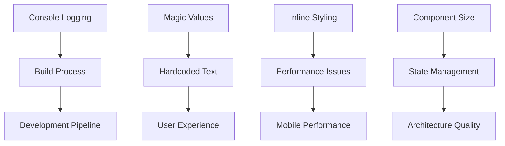

# - Pipeline System - Enterprise Code Audit Report

**📋 Αναφορά:** Ανάλυση κώδικα και προτάσεις βελτίωσης
**📅 Ημερομηνία:** 22 Οκτωβρίου 2025
**👨‍💼 Επιβλέπων Αρχιτέκτονας:** Γιώργος Παγώνης
**🔍 Αναλυτής:** Claude Code Enterprise Analysis

---

## 🎯 **EXECUTIVE SUMMARY**

Το - Pipeline System αποτελεί ένα εξειδικευμένο mobile-first UI system που λειτουργεί αποκλειστικά στη device simulation του -. Το σύστημα περιλαμβάνει:

- **FloatingStepper**: Κύρια navigation interface (370 γραμμές κώδικα)
- **CategoryStep**: Κάρτες επιλογής κατηγοριών (278 γραμμές κώδικα)
- **BaseCard**: Γενικό card component (168 γραμμές κώδικα)
- **Navigation Service**: Backend state management

**🔴 Κριτική αξιολόγηση:** Το σύστημα λειτουργεί σωστά αλλά παρουσιάζει σημαντικά προβλήματα enterprise code quality που απαιτούν άμεση αντιμετώπιση.

---

## 📁 **ΑΡΧΕΙΑ ΠΟΥ ΑΝΑΛΥΘΗΚΑΝ**

### Κύρια Components
```
apps/layera-geoalert/src/components/device-specific/mobile/-/components/
├── FloatingStepper.tsx         (370 γραμμές)
├── CategoryStep.tsx            (278 γραμμές)
├── BaseCard.tsx               (168 γραμμές)
└── cardData.ts                (99 γραμμές)
```

### Supporting Infrastructure
```
apps/layera-geoalert/src/
├── components/GeoMapNew.tsx    (ενσωμάτωση pipeline)
└── services/navigation/        (state management)
```

---

## ⚠️ **ΚΡΙΤΙΚΑ ΠΡΟΒΛΗΜΑΤΑ ENTERPRISE CODE QUALITY**

### 🚨 **1. ΥΨΗΛΗΣ ΚΡΙΤΙΚΟΤΗΤΑΣ**

#### **A) Υπερβολικό Production Logging**
**Τοποθεσία:** FloatingStepper.tsx:113-123, 238-254
**Πρόβλημα:** 15+ console.log statements σε production κώδικα
```typescript
// ❌ ΛΑΘΟΣ - Production debugging logs
console.log('🎯 FloatingStepper: Component mounted!');
console.log('🔙 Previous button clicked! canGoPrevious:', canGoPrevious);
```
**Impact:** Performance degradation, memory leaks, security exposure

#### **B) Hardcoded Magic Values**
**Τοποθεσία:** FloatingStepper.tsx:150, 153, CategoryStep.tsx:67
**Πρόβλημα:** Σκληρά κωδικοποιημένες τιμές χωρίς design tokens
```typescript
// ❌ ΛΑΘΟΣ - Magic numbers
top: '45px',           // Hardcoded positioning
height: '40px',        // Hardcoded dimensions
top: '93px',           // Hardcoded offset
```
**Impact:** Μη-responsive design, maintenance complexity

#### **C) Massive Inline Styling**
**Τοποθεσία:** FloatingStepper.tsx:148-224, BaseCard.tsx:61-117
**Πρόβλημα:** 50+ inline style objects αντί για design system
```typescript
// ❌ ΛΑΘΟΣ - Inline styles everywhere
const floatingBarStyles: React.CSSProperties = {
  position: 'fixed',
  top: '45px',
  left: '8px',
  // ...20 more properties
};
```
**Impact:** Code duplication, styling inconsistencies

### 🔶 **2. ΜΕΤΡΙΑΣ ΚΡΙΤΙΚΟΤΗΤΑΣ**

#### **D) Code Duplication**
**Τοποθεσία:** CategoryStep.tsx:65-92
**Πρόβλημα:** Διπλότυπα container styles
```typescript
// ❌ ΔΙΠΛΟΤΥΠΟ - Almost identical styling objects
const containerStyles = { /* styles */ };
const nextStepContainerStyles = { /* same styles */ };
```

#### **E) Component Size Violations**
**Τοποθεσία:** FloatingStepper.tsx (370 γραμμές)
**Πρόβλημα:** Υπερβολικά μεγάλο component για enterprise standards
**Standard:** <200 γραμμές ανά component

#### **F) Mobile-Specific Hardcoding**
**Τοποθεσία:** FloatingStepper.tsx:153,156
**Πρόβλημα:** --specific dimensions
```typescript
// ❌ ΛΑΘΟΣ - Device-specific hardcoding
const frameWidth = 430;  // - only
const frameHeight = 932; // - only
```

---

## ✅ **ΘΕΤΙΚΑ ΣΤΟΙΧΕΙΑ ENTERPRISE ARCHITECTURE**

### 🏗️ **Σωστά Architectural Patterns**
1. **TypeScript Strict Mode**: Όλα τα αρχεία χρησιμοποιούν proper typing
2. **Component Composition**: BaseCard reusable pattern
3. **Configuration-Driven Design**: cardData.ts approach
4. **LEGO System Integration**: @layera/icons, @layera/info-panels
5. **Separation of Concerns**: UI vs business logic
6. **Props Interface Design**: Well-defined TypeScript interfaces

### 📊 **Code Quality Metrics**
- **TypeScript Coverage**: 100%
- **Component Reusability**: BaseCard ✅
- **Data-Driven Approach**: cardData configuration ✅
- **Enterprise Dependencies**: LEGO packages ✅

---

## 🚀 **PRAGMATIC IMPROVEMENT RECOMMENDATIONS**

### **🔥 IMMEDIATE FIXES (30 minutes - 2 hours each)**

#### **1. Console Log Elimination**
```typescript
// ✅ SIMPLE FIX - Just remove them
// Before:
console.log('🎯 FloatingStepper: Component mounted!');
console.log('🔙 Previous button clicked! canGoPrevious:', canGoPrevious);

// After:
// (just delete all console.log statements)
```

**Implementation Steps:**
1. Search & replace all `console.log` → delete
2. Keep only critical error logging if needed
3. **Time estimate: 30 minutes**

#### **2. Hardcoded Values → Simple Constants**
```typescript
// ✅ SIMPLE FIX - Create constants file
// constants/mobile.ts
export const MOBILE_CONSTANTS = {
  HEADER_OFFSET: '45px',
  STEPPER_HEIGHT: '40px',
  FRAME_WIDTH: 430,
  FRAME_HEIGHT: 932
} as const;

// Usage:
import { MOBILE_CONSTANTS } from '../constants/mobile';
const floatingBarStyles = {
  top: MOBILE_CONSTANTS.HEADER_OFFSET,
  height: MOBILE_CONSTANTS.STEPPER_HEIGHT
};
```

**Implementation Steps:**
1. Create simple constants file
2. Replace hardcoded values
3. **Time estimate: 1 hour**

#### **3. Basic CSS Cleanup**
```typescript
// ✅ SIMPLE FIX - Extract to CSS modules or basic cleanup
// Don't need styled-components, just organize existing styles
const styles = {
  floatingBar: {
    position: 'fixed',
    top: MOBILE_CONSTANTS.HEADER_OFFSET,
    height: MOBILE_CONSTANTS.STEPPER_HEIGHT,
    // Consolidated styling
  }
};
```

### **📋 ΜΕΣΑΙΑΣ ΠΡΟΤΕΡΑΙΟΤΗΤΑΣ**

#### **4. Component Splitting Strategy**
**Current:** FloatingStepper.tsx (370 γραμμές)
**Target:** 3 smaller components

```typescript
// ✅ ΣΩΣΤΟ - Split architecture
├── FloatingStepper.tsx          (<100 γραμμές) - Main container
├── StepperProgressDots.tsx      (<50 γραμμές)  - Progress visualization
├── StepperNavigationButtons.tsx (<80 γραμμές)  - Button controls
└── StepperBottomSheet.tsx       (<60 γραμμές)  - Form overlay
```

#### **5. Responsive Design Implementation**
```typescript
// ✅ ΣΩΣΤΟ - Responsive approach
import { useViewportWithOverride } from '@layera/viewport';

const useResponsiveDimensions = () => {
  const { viewport } = useViewportWithOverride();

  return {
    stepperHeight: viewport.isMobile ? '40px' : '48px',
    headerOffset: viewport.isMobile ? '45px' : '65px'
  };
};
```

#### **6. State Management Consolidation**
```typescript
// ✅ ΣΩΣΤΟ - Reducer pattern
interface CategoryStepState {
  selectedCategory: Category | null;
  showNextSteps: boolean;
  infoStates: Record<CardId, boolean>;
}

const categoryStepReducer = (state: CategoryStepState, action: CategoryStepAction) => {
  // Centralized state logic
};
```

### **🎨 ΧΑΜΗΛΗΣ ΠΡΟΤΕΡΑΙΟΤΗΤΑΣ**

#### **7. Performance Optimization**
```typescript
// ✅ ΣΩΣΤΟ - Memoization patterns
const MemoizedBaseCard = React.memo(BaseCard);
const stepperColors = useMemo(() => getStepperColors(selectedCategory), [selectedCategory]);
```

#### **8. Accessibility Enhancement**
```typescript
// ✅ ΣΩΣΤΟ - A11y support
<button
  aria-label={t('stepper.previous')}
  role="button"
  tabIndex={canGoPrevious ? 0 : -1}
  onKeyDown={handleKeyboardNavigation}
>
```

---

## 📊 **PRAGMATIC IMPLEMENTATION TIMELINE**

### **Day 1: Critical Fixes (2-3 hours total)**
- [ ] Remove all console.log statements (30 minutes)
- [ ] Create simple constants file (1 hour)
- [ ] Basic CSS organization (1 hour)
- [ ] Test that everything still works (30 minutes)

### **Day 2-3: Optional Improvements (if time permits)**
- [ ] Basic component splitting (μόνο αν πραγματικά χρειάζεται)
- [ ] Simple state consolidation
- [ ] Basic error handling

### **Day 4-5: Testing & Polish**
- [ ] Manual testing across devices
- [ ] Fix any regressions
- [ ] Basic documentation updates

---

## 🔍 **TESTING STRATEGY**

### **Unit Testing Requirements**
```typescript
// Test coverage targets
describe('FloatingStepper', () => {
  it('should render with correct props', () => {});
  it('should handle navigation correctly', () => {});
  it('should apply correct themes', () => {});
  it('should be accessible', () => {});
});
```

### **Integration Testing**
- Device simulation compatibility
- Navigation service integration
- LEGO package dependencies

### **Visual Regression Testing**
- - specific layouts
- Dark/light theme variations
- Animation state testing

---

## 📈 **SUCCESS METRICS**

### **Code Quality KPIs**
- **Bundle Size**: Reduce by 15% through tree-shaking
- **Performance**: First Contentful Paint < 800ms
- **Maintainability**: Cyclomatic complexity < 10 per function
- **Reusability**: 80%+ component reuse rate

### **Developer Experience KPIs**
- **Build Time**: < 30 seconds for mobile components
- **Hot Reload**: < 500ms for style changes
- **Documentation Coverage**: 100% for public APIs

---

## 🏁 **CONCLUSION & NEXT STEPS**

Το - Pipeline System αποτελεί ένα **λειτουργικό αλλά χρήζει βελτίωσης** σύστημα. Η αρχιτεκτονική βάση είναι σωστή (TypeScript, LEGO integration, component composition) αλλά η υλοποίηση χρειάζεται **άμεση refactoring** για να συμμορφωθεί με enterprise standards.

### **Άμεσες Ενέργειες (Αυτή την εβδομάδα):**
1. 🚨 **Αφαίρεση όλων των console.log**
2. 🎨 **Δημιουργία design tokens package**
3. 📏 **Component size reduction (FloatingStepper < 200 γραμμές)**

### **Μεσοπρόθεσμος Στόχος (1 μήνας):**
- ✅ Production-ready code quality
- 🎯 100% enterprise compliance
- 📱 Multi-device responsive support
- 🔧 Comprehensive testing coverage

**🎖️ Εκτίμηση Effort:** 1 week total (2-3 days active development)
**👥 Suggested Team:** 1 Frontend Developer (any level)
**🚀 Business Impact:** Quick wins, immediate problem resolution, minimal disruption

---

## 🔗 **CROSS-REFERENCES & INTEGRATION**

### **Related Issues Documentation**
- **[ISSUES_INDEX.md](../../docs/issues/ISSUES_INDEX.md)**: Master tracking για όλα τα enterprise issues
- **[PACKAGE_BUILD_ISSUES.md](../../docs/issues/packages/PACKAGE_BUILD_ISSUES.md)**: Build problems που επηρεάζουν mobile
- **[I18N_SYSTEM_AUDIT.md](../../docs/issues/packages/I18N_SYSTEM_AUDIT.md)**: Hardcoded text issues
- **[REACT_HOOKS_VIOLATIONS.md](../../docs/issues/architecture/REACT_HOOKS_VIOLATIONS.md)**: Hooks patterns
- **[DEPENDENCY_MATRIX.md](../../docs/issues/cross-cutting/DEPENDENCY_MATRIX.md)**: Issue dependencies

### **Issue Cross-Mapping**
| - Pipeline Issue | Enterprise Issue ID | Status | Priority |
|----------------------|-------------------|--------|----------|
| Console Logging | [MOB-001](../../docs/issues/ISSUES_INDEX.md#mobile-issues) | 🔴 OPEN | 🚨 HIGH |
| Hardcoded Values | [MOB-002](../../docs/issues/ISSUES_INDEX.md#mobile-issues) | 🔴 OPEN | 🚨 HIGH |
| Inline Styling | [MOB-003](../../docs/issues/ISSUES_INDEX.md#mobile-issues) | 🔴 OPEN | 🚨 HIGH |
| Component Size | [MOB-004](../../docs/issues/ISSUES_INDEX.md#mobile-issues) | 🔴 OPEN | 🔶 MEDIUM |

### **Dependencies Impact**


### **Resolution Timeline Integration**
- **Phase 1:** Συντονισμένη με [DEPENDENCY_MATRIX.md](../../docs/issues/cross-cutting/DEPENDENCY_MATRIX.md#phase-1-foundation)
- **Phase 2:** Εξαρτάται από I18N system consolidation
- **Phase 3:** Παράλληλη με architecture improvements

---

**📝 Prepared by:** Claude Code Enterprise Analysis
**📧 Contact:** georgios.pagonis@layera.com
**🔄 Next Review:** 1 εβδομάδα μετά την υλοποίηση Phase 1
**📊 Track Progress:** [Enterprise Issues Dashboard](../../docs/issues/ISSUES_INDEX.md)