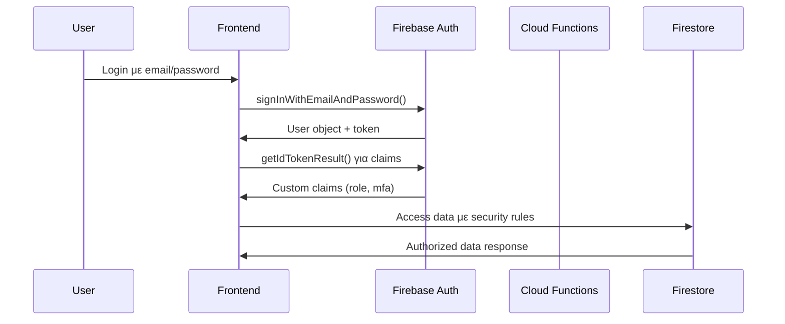
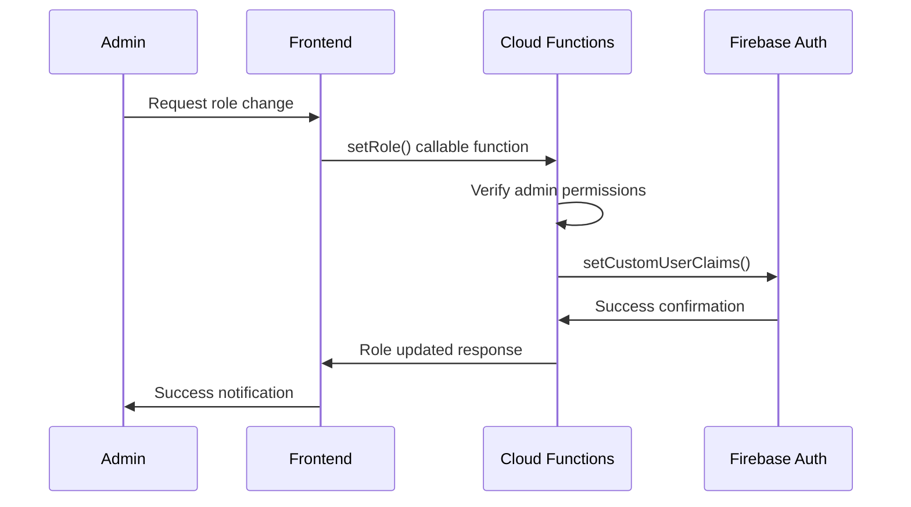
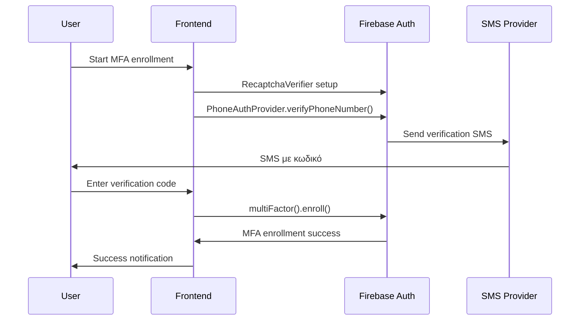

# 🏗️ Layera ID - Architecture Documentation

## 📋 Περιγραφή Συστήματος

Το **Layera ID** είναι ένα ολοκληρωμένο **enterprise monorepo** συστήματος διαχείρισης ταυτότητας και πρόσβασης (Identity & Access Management) που υλοποιεί προηγμένες τεχνολογίες ασφάλειας και παρέχει επαναχρησιμοποιήσιμα packages για εύκολη ενσωμάτωση.

## 🎯 Κύριες Λειτουργίες

### 🔐 Σύστημα Πιστοποίησης (Authentication)
- **Firebase Authentication** με Email/Password
- **Υποχρεωτική Email Verification** για όλους τους χρήστες
- **Multi-Factor Authentication (TOTP)** με Google Authenticator/Authy για ειδικούς ρόλους
- **Custom Claims** για προχωρημένο έλεγχο δικαιωμάτων

### 👥 Διαχείριση Ρόλων (RBAC - Role-Based Access Control)
- **private**: Βασικός χρήστης (default)
- **broker**: Μεσίτης με ειδικά δικαιώματα (απαιτεί TOTP)
- **builder**: Κατασκευαστής με εκτεταμένα δικαιώματα (απαιτεί TOTP)
- **admin**: Διαχειριστής με πλήρη δικαιώματα (απαιτεί TOTP)

### 🛡️ Ασφάλεια
- **Firestore Security Rules** με έλεγχο ρόλων και MFA
- **Secure Cloud Functions** για admin operations
- **Email verification** υποχρεωτικό για όλες τις λειτουργίες
- **TOTP enforcement** για privileged roles με backup codes

## 🏛️ Αρχιτεκτονική Συστήματος

### 📁 Monorepo Structure
```
layera/                            # Root monorepo
├── package.json                   # Workspace configuration
├── apps/                          # Applications
│   └── layera-id/                 # Main React Application
│       ├── src/
│       │   ├── components/        # UI Components
│       │   ├── pages/             # Page components
│       │   └── main.jsx           # App entry με AuthProvider
│       └── package.json           # App dependencies
├── packages/                      # Reusable packages
│   └── auth-bridge/               # 🔥 Core Authentication Package
│       ├── src/
│       │   ├── components/        # AuthProvider, RoleGuard, TotpSetup
│       │   ├── hooks/             # useAuth, useTotp, useRoleGuard
│       │   ├── types/             # TypeScript definitions
│       │   └── utils/             # Firebase, TOTP, Claims utilities
│       ├── dist/                  # Built package
│       ├── package.json           # Package configuration
│       └── README.md              # Package documentation
├── functions/                     # Firebase Cloud Functions
│   ├── src/
│   │   └── index.ts               # Admin role management APIs
│   └── package.json               # Functions dependencies
├── tools/admin/                   # Admin CLI tools
│   ├── set-role.mjs               # Role assignment script
│   └── check-user.mjs             # User status verification
├── docs/                          # Enterprise Documentation
│   ├── ARCHITECTURE.md            # System architecture (αυτό το αρχείο)
│   ├── API.md                     # API Documentation
│   ├── SECURITY.md                # Security Guidelines
│   ├── DEPLOYMENT.md              # Deployment Guide
│   ├── CODE_MAPPING.md            # Code-to-docs traceability
│   └── MONOREPO_MIGRATION_PLAN.md # Migration guide
├── firestore.rules                # Database security rules
├── storage.rules                  # Storage security rules
├── firebase.json                  # Firebase configuration
├── export-code.ps1                # Backup automation
└── create-backup.ps1              # Simplified backup script
```

### 🔧 Τεχνολογικό Stack

#### Frontend
- **React 19.1.1** - Modern UI framework
- **Vite 7.1.7** - Fast build tool και dev server
- **Tailwind CSS 4.1.14** - Utility-first CSS framework
- **React Router DOM 7.9.4** - Client-side routing

#### Backend & Database
- **Firebase Authentication** - Identity management
- **Cloud Firestore** - NoSQL document database
- **Firebase Cloud Functions** - Serverless backend logic
- **Firebase Storage** - File storage με security rules

#### Development & Testing
- **Vitest 3.2.4** - Unit testing framework
- **React Testing Library 16.3.0** - Component testing
- **ESLint 9.36.0** - Code linting
- **TypeScript** - Type safety για Cloud Functions

#### Package Architecture
- **@layera/auth-bridge** - Core επαναχρησιμοποιήσιμο authentication package
  - React hooks & components
  - TOTP utilities με QR code generation
  - TypeScript types και interfaces
  - Firebase integration utilities
  - Comprehensive testing support

## 🌊 Data Flow Architecture

### 1. User Authentication Flow


### 2. Role Management Flow


### 3. MFA Enrollment Flow


## 🔗 Component Dependencies

### AuthContext Provider
```javascript
// Κεντρική διαχείριση authentication state
// 📁 Implementation: apps/layera-id/src/contexts/AuthContext.jsx
const AuthContext = {
  currentUser: User | null,
  claims: { role: string, mfa: boolean },
  loading: boolean,
  signup: (email, password) => Promise,
  login: (email, password) => Promise,
  logout: () => Promise,
  resetPassword: (email) => Promise
}
```

**📖 Related Documentation:**
- [API Documentation - Authentication APIs](./API.md#authentication-apis)
- [Security Documentation - Authentication Security](./SECURITY.md#authentication-security)

### PrivateRoute Component
```javascript
// Route protection με έλεγχο MFA
// 📁 Implementation: apps/layera-id/src/components/PrivateRoute.jsx
const PrivateRoute = {
  requiresMfa: boolean,           // Απαίτηση 2FA
  allowedRoles: string[],         // Επιτρεπόμενοι ρόλοι
  children: ReactElement          // Protected content
}
```

**📖 Related Documentation:**
- [Security Documentation - Authorization Security](./SECURITY.md#authorization-security-rbac)
- [API Documentation - Authentication Flow](./API.md#authentication-apis)

## 📊 Database Schema

### Users Collection (Firestore)
```javascript
// 📁 Security Rules: firestore.rules (lines 15-17)
// 📁 API Implementation: See API.md#user-document-access
users/{uid} = {
  email: string,
  displayName: string,
  role: "private" | "broker" | "builder" | "admin",
  mfaEnabled: boolean,
  emailVerified: boolean,
  createdAt: Timestamp,
  lastLogin: Timestamp,
  profile: {
    firstName: string,
    lastName: string,
    phone?: string,
    company?: string
  }
}
```

**📖 Related Documentation:**
- [Security Documentation - Database Security](./SECURITY.md#database-security-firestore-rules)
- [API Documentation - Firestore APIs](./API.md#firestore-apis)

### Projects Collection (Firestore)
```javascript
projects/{projectId} = {
  title: string,
  description: string,
  ownerId: string,               // User UID
  createdAt: Timestamp,
  updatedAt: Timestamp,
  status: "draft" | "active" | "completed",
  assignedBrokers: string[],     // User UIDs
  assignedBuilders: string[]     // User UIDs
}
```

## 🚀 Scalability Considerations

### Performance Optimization
- **Code Splitting** με React lazy loading
- **Bundle Optimization** με Vite
- **Firestore Indexing** για complex queries
- **CDN Delivery** για static assets

### Security Scalability
- **Rate Limiting** στα Cloud Functions
- **CORS Configuration** για API security
- **Environment Variables** για sensitive data
- **Security Rules Testing** με Firebase Emulator

### Infrastructure Scalability
- **Auto-scaling** Cloud Functions
- **Multi-region Deployment** για global availability
- **Backup Strategy** με automated exports
- **Monitoring & Logging** με Firebase Analytics

## 🔄 State Management

### Client-Side State
```javascript
// AuthContext state structure
{
  user: {
    uid: string,
    email: string,
    displayName: string,
    emailVerified: boolean
  },
  claims: {
    role: "private" | "broker" | "builder" | "admin",
    mfa: boolean
  },
  loading: boolean
}
```

### Server-Side State
```javascript
// Custom Claims στο Firebase Auth Token
{
  role: "private" | "broker" | "builder" | "admin",
  mfa: boolean,
  iat: number,    // Token issued at
  exp: number     // Token expires at
}
```

---

**Τελευταία ενημέρωση**: 17/10/2025
**Έκδοση**: 1.0
**Συντηρητής**: Layera Development Team