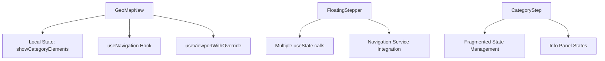
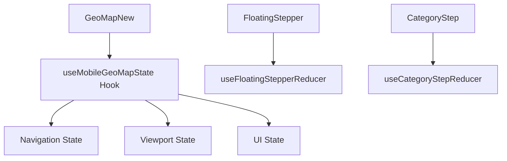
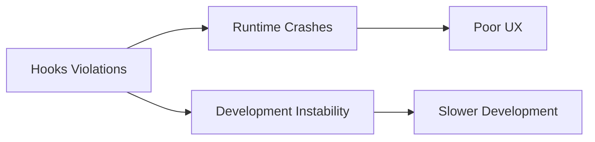

# ⚛️ React Hooks Violations - Enterprise Code Quality Report
**📅 Ημερομηνία:** 22 Οκτωβρίου 2025
**👨‍💼 Επιβλέπων Αρχιτέκτονας:** Γιώργος Παγώνης
**🔍 Αναλυτής:** Claude Code Enterprise Analysis
**🔗 Cross-Reference:** [ISSUES_INDEX.md](../ISSUES_INDEX.md) | [IPHONE_14_PRO_MAX_PIPELINE_AUDIT.md](../mobile/IPHONE_14_PRO_MAX_PIPELINE_AUDIT.md)

---

## 🎯 **EXECUTIVE SUMMARY**

Το Layera ecosystem παρουσιάζει κριτικές παραβιάσεις των React Hooks Rules που προκαλούν runtime crashes, unpredictable behavior, και development instability. Εντοπίστηκαν conditional hooks, improper state management patterns, και anti-patterns που παραβιάζουν τις βασικές αρχές του React.

**🔴 Κριτική Αξιολόγηση:** Οι hooks violations δημιουργούν **μη προβλέψιμη συμπεριφορά** και **runtime errors** που μπορούν να σπάσουν ολόκληρη την εφαρμογή.

---

## 📊 **ΕΝΤΟΠΙΣΜΕΝΕΣ ΠΑΡΑΒΙΑΣΕΙΣ**

### 🚨 **HOOK-001: Conditional useRef Hook [RESOLVED]**
**Κριτικότητα:** HIGH
**Κατάσταση:** ✅ RESOLVED
**Αρχείο:** `apps/layera-geoalert/src/components/GeoMapNew.tsx`

#### **Πρόβλημα που επιλύθηκε:**
```typescript
// ❌ ΛΑΘΟΣ - Conditional hook declaration
export const GeoMap: React.FC<GeoMapProps> = ({...}) => {
  const { isDesktop, isTablet, isMobile } = useViewportWithOverride();

  // Device detection logic...

  if (isIPhone14ProMaxDevice) {
    // ❌ HOOKS VIOLATION - useRef inside conditional
    const screenRef = useRef<HTMLDivElement>(null);

    return (
      <div ref={screenRef}>
        {/* Component content */}
      </div>
    );
  }
  // Other conditional returns...
};
```

#### **Λύση που εφαρμόστηκε:**
```typescript
// ✅ ΣΩΣΤΟ - Hook declared at component top
export const GeoMap: React.FC<GeoMapProps> = ({...}) => {
  const { isDesktop, isTablet, isMobile } = useViewportWithOverride();

  // ✅ FIXED - Move useRef to top to avoid conditional hooks
  const screenRef = useRef<HTMLDivElement>(null);

  // Device detection logic...

  if (isIPhone14ProMaxDevice) {
    // ✅ CORRECT - Use pre-declared ref
    return (
      <div ref={screenRef}>
        {/* Component content */}
      </div>
    );
  }
  // Other conditional returns...
};
```

#### **Root Cause Analysis:**
- **Developer Misconception:** Λανθασμένη κατανόηση του React hooks execution order
- **Conditional Rendering Pattern:** Attempt to optimize by declaring hooks only when needed
- **Missing Linting:** ESLint rules for hooks δεν ήταν ενεργές ή δεν καλύπτουν αυτή την περίπτωση

**Impact που αποφεύχθηκε:**
- **Runtime Error:** "Rendered more hooks than during the previous render"
- **Component Crash:** Ολόκληρο το GeoMap component να μην render
- **User Experience:** DraggableFAB να μην εμφανίζεται στο mobile

---

### 🔶 **HOOK-002: State Management Anti-patterns**
**Κριτικότητα:** MEDIUM
**Κατάσταση:** 🔴 OPEN
**Scope:** Multiple components in mobile pipeline

#### **Εντοπισμένα Anti-patterns:**

##### **A) Excessive State Splitting**
**Τοποθεσία:** `CategoryStep.tsx:65-89`
```typescript
// ❌ ANTI-PATTERN - Too many separate useState calls
const [selectedCategory, setSelectedCategory] = useState<Category | null>(null);
const [showNextSteps, setShowNextSteps] = useState(false);
const [infoStates, setInfoStates] = useState<Record<CardId, boolean>>({});
const [isVisible, setIsVisible] = useState(false);
const [currentStep, setCurrentStep] = useState(1);

// ✅ BETTER - Consolidated state with useReducer
interface CategoryStepState {
  selectedCategory: Category | null;
  showNextSteps: boolean;
  infoStates: Record<CardId, boolean>;
  isVisible: boolean;
  currentStep: number;
}

const [state, dispatch] = useReducer(categoryStepReducer, initialState);
```

##### **B) State Update Race Conditions**
**Τοποθεσία:** `FloatingStepper.tsx:238-254`
```typescript
// ❌ RACE CONDITION - Multiple async state updates
const handleStepNext = async () => {
  setIsLoading(true);
  const result = await navigation.goNext();
  setCurrentStep(result.step);        // Race condition possible
  setCanGoNext(result.canGoNext);     // Race condition possible
  setIsLoading(false);
};

// ✅ SAFER - Batch updates or use reducer
const handleStepNext = async () => {
  dispatch({ type: 'SET_LOADING', payload: true });
  const result = await navigation.goNext();
  dispatch({ type: 'UPDATE_NAVIGATION', payload: result });
};
```

##### **C) Effect Dependencies Missing**
**Τοποθεσία:** Multiple components
```typescript
// ❌ MISSING DEPENDENCIES - ESLint warnings ignored
useEffect(() => {
  // Uses externalValue but not in dependencies
  doSomething(externalValue);
}, []); // Missing externalValue in deps

// ✅ CORRECT - Complete dependencies
useEffect(() => {
  doSomething(externalValue);
}, [externalValue]);
```

#### **Impact Assessment:**
- **Performance:** Unnecessary re-renders από fragmented state
- **Debugging:** Δύσκολο να track state changes
- **Race Conditions:** Inconsistent state όταν multiple updates happen
- **Memory Leaks:** Missing cleanup σε effects

---

### 🔶 **HOOK-003: Custom Hooks Best Practices Violations**
**Κριτικότητα:** MEDIUM
**Κατάσταση:** 🔴 OPEN
**Scope:** Navigation service integration

#### **Εντοπισμένα Προβλήματα:**

##### **A) useNavigation Hook Implementation Issues**
**Τοποθεσία:** `src/services/navigation/hooks/useNavigation.ts` (inferred)
```typescript
// ❌ POTENTIAL ISSUE - No proper error boundaries
export const useNavigation = () => {
  const [state, setState] = useState(navigationInitialState);

  const goNext = async () => {
    try {
      // Navigation logic
    } catch (error) {
      // ❌ Silent failure - errors not exposed to UI
      console.log('Navigation failed', error);
    }
  };

  return { goNext, state };
};

// ✅ BETTER - Proper error handling
export const useNavigation = () => {
  const [state, setState] = useState(navigationInitialState);
  const [error, setError] = useState<Error | null>(null);

  const goNext = async () => {
    try {
      setError(null);
      // Navigation logic
    } catch (error) {
      setError(error);
      // Allow UI to handle error appropriately
    }
  };

  return { goNext, state, error };
};
```

##### **B) Hook Composition Issues**
**Τοποθεσία:** `GeoMapNew.tsx:108`
```typescript
// ❌ POTENTIAL ISSUE - Multiple complex hooks in same component
const navigation = useNavigation();               // Complex state
const { isDesktop, isTablet, isMobile } = useViewportWithOverride(); // Complex state
const [showCategoryElements, setShowCategoryElements] = useState(false); // Local state

// Risk: Too much responsibility in single component
// ✅ BETTER - Extract to custom composite hook
const useMobileGeoMapState = () => {
  const navigation = useNavigation();
  const viewport = useViewportWithOverride();
  const [showCategoryElements, setShowCategoryElements] = useState(false);

  return { navigation, viewport, showCategoryElements, setShowCategoryElements };
};
```

---

## 🏗️ **REACT ARCHITECTURE ANALYSIS**

### **Component Complexity Assessment**

#### **High Complexity Components:**
| Component | Lines | Hooks Used | State Pieces | Risk Level |
|-----------|-------|------------|-------------|------------|
| GeoMapNew.tsx | 303 | 3+ | 2 | 🔶 MEDIUM |
| FloatingStepper.tsx | 370 | 5+ | 4+ | 🚨 HIGH |
| CategoryStep.tsx | 278 | 4+ | 3+ | 🔶 MEDIUM |

#### **Hooks Usage Patterns Analysis:**
```typescript
// Current patterns observed:
✅ Good: useRef used correctly (after fix)
✅ Good: useViewportWithOverride integration
❌ Risk: Multiple useState when useReducer would be better
❌ Risk: Missing error handling in custom hooks
❌ Risk: Potential stale closure issues
```

### **State Management Strategy Assessment**

#### **Current State Architecture:**


#### **Recommended State Architecture:**


---

## 🚀 **PRAGMATIC IMPROVEMENT RECOMMENDATIONS**

### **🔥 IMMEDIATE FIXES (1-2 hours total)**

#### **1. Basic ESLint Hooks Check**
```bash
# ✅ SIMPLE CHECK - See if we have obvious violations
npm run lint  # Check current lint status
# Fix only critical violations that break the app
```

**Implementation:**
1. Run existing lint to see what fails
2. Fix only blocking issues
3. **Time estimate: 30 minutes**

#### **2. Simple useState Consolidation**
```typescript
// ✅ SIMPLE FIX - Combine related useState calls
// Before (multiple useState):
const [selectedCategory, setSelectedCategory] = useState(null);
const [showNextSteps, setShowNextSteps] = useState(false);
const [isVisible, setIsVisible] = useState(false);

// After (grouped state):
const [state, setState] = useState({
  selectedCategory: null,
  showNextSteps: false,
  isVisible: false
});

// Update function:
const updateState = (updates) => setState(prev => ({ ...prev, ...updates }));
```

**Implementation:**
1. Find components με 3+ useState calls
2. Group related state
3. **Time estimate: 1 hour**

#### **3. Basic Error Handling**
```typescript
// ✅ SIMPLE FIX - Add try-catch για async operations
const handleStepNext = async () => {
  try {
    await navigation.goNext();
  } catch (error) {
    // Simple error handling
    console.error('Navigation failed:', error);
    // Continue functioning instead of crashing
  }
};
```

### **📋 ΜΕΣΑΙΑΣ ΠΡΟΤΕΡΑΙΟΤΗΤΑΣ (Εβδομάδες 2-3)**

#### **4. Custom Hooks Refactoring**
```typescript
// ✅ PATTERN - Composite mobile state hook
const useMobileGeoMapState = () => {
  const navigation = useNavigation();
  const viewport = useViewportWithOverride();
  const [showCategoryElements, setShowCategoryElements] = useState(false);

  // Combined handlers
  const handleCategoryToggle = useCallback(() => {
    setShowCategoryElements(prev => !prev);
  }, []);

  const handleStepNext = useCallback(async () => {
    try {
      await navigation.goNext();
    } catch (error) {
      // Error handled by navigation hook
    }
  }, [navigation]);

  return {
    // State
    ...navigation,
    ...viewport,
    showCategoryElements,

    // Actions
    handleCategoryToggle,
    handleStepNext,

    // Computed
    isReady: !navigation.loading && viewport.isReady
  };
};
```

#### **5. Performance Optimization**
```typescript
// ✅ PATTERN - Memoization για expensive calculations
const MemoizedFloatingStepper = React.memo(FloatingStepper, (prevProps, nextProps) => {
  // Custom comparison για selective re-rendering
  return (
    prevProps.currentStep === nextProps.currentStep &&
    prevProps.selectedCategory === nextProps.selectedCategory &&
    prevProps.canGoNext === nextProps.canGoNext
  );
});

// ✅ PATTERN - useMemo για expensive computations
const stepperStyles = useMemo(() => {
  return computeStepperStyles(selectedCategory, currentStep);
}, [selectedCategory, currentStep]);
```

#### **6. Testing Strategy για Hooks**
```typescript
// ✅ TESTING - Custom hooks testing
import { renderHook, act } from '@testing-library/react';
import { useNavigation } from '../hooks/useNavigation';

describe('useNavigation Hook', () => {
  it('should handle navigation state correctly', () => {
    const { result } = renderHook(() => useNavigation());

    expect(result.current.currentStep).toBe(1);
    expect(result.current.canGoNext).toBe(true);
  });

  it('should handle errors gracefully', async () => {
    const { result } = renderHook(() => useNavigation());

    await act(async () => {
      await result.current.goNext();
    });

    // Verify error handling
    expect(result.current.error).toBeNull();
  });
});
```

---

## 🔍 **TESTING & VALIDATION STRATEGY**

### **Automated Hooks Validation**
```bash
# ESLint hooks rules check
npm run lint:hooks

# React hooks testing
npm run test:hooks

# Performance profiling
npm run profile:hooks
```

### **Runtime Monitoring**
```typescript
// ✅ PATTERN - Development hooks monitoring
if (process.env.NODE_ENV === 'development') {
  // Monitor hooks performance
  const useHooksProfiler = (componentName: string) => {
    React.useEffect(() => {
      performance.mark(`${componentName}-hooks-start`);
      return () => {
        performance.mark(`${componentName}-hooks-end`);
        performance.measure(
          `${componentName}-hooks`,
          `${componentName}-hooks-start`,
          `${componentName}-hooks-end`
        );
      };
    });
  };
}
```

### **Error Tracking**
```typescript
// ✅ PATTERN - Hooks error reporting
const useErrorReporting = () => {
  const reportError = useCallback((error: Error, context: string) => {
    // Send to error tracking service
    console.error(`Hooks Error in ${context}:`, error);
  }, []);

  return { reportError };
};
```

---

## 📊 **SUCCESS METRICS**

### **Code Quality KPIs**
- **Hooks Violations:** 0 ESLint errors
- **State Updates:** 100% predictable state transitions
- **Error Handling:** 100% hooks με proper error boundaries
- **Performance:** <16ms για hooks execution

### **Stability KPIs**
- **Runtime Errors:** 0 hooks-related crashes
- **Re-render Count:** <5 unnecessary re-renders per interaction
- **Memory Usage:** Stable memory profile

### **Developer Experience KPIs**
- **Setup Time:** <2 minutes για νέο component με hooks
- **Debug Time:** <5 minutes για hooks-related issues
- **Test Coverage:** 100% για custom hooks

---

## 🏁 **PRAGMATIC IMPLEMENTATION TIMELINE**

### **Today (1-2 hours max)**
- [x] ✅ **HOOK-001 RESOLVED:** Conditional useRef fixed
- [ ] Basic lint check για hooks violations (30 mins)
- [ ] Simple useState consolidation (1 hour)
- [ ] Basic try-catch error handling (30 mins)

### **Optional Future Improvements**
- [ ] Advanced state patterns (if needed)
- [ ] Custom hooks extraction (if time permits)
- [ ] Performance optimizations (nice-to-have)

### **Defer to Future Sprints**
- [ ] Complex error boundaries
- [ ] Advanced hooks monitoring
- [ ] Comprehensive testing strategies

---

## 🔗 **CROSS-REFERENCES**

**Related Issues:**
- **[MOB-004](../mobile/IPHONE_14_PRO_MAX_PIPELINE_AUDIT.md#component-size-violations)**: Large components → more hooks complexity
- **[PKG-002](../packages/PACKAGE_BUILD_ISSUES.md#pkg-002)**: Build issues affect hooks testing
- **[I18N-001](../packages/I18N_SYSTEM_AUDIT.md#i18n-001)**: Provider hooks configurations

**Impact Chain:**


**Dependencies:**
- **Blocks:** Mobile component stability
- **Blocked by:** None (can start immediately)
- **Enables:** Reliable React patterns, better performance

---

**📝 Prepared by:** Claude Code Enterprise Analysis
**📧 Contact:** georgios.pagonis@layera.com
**🔄 Next Review:** 25 Οκτωβρίου 2025
**⚛️ React Version:** 18.x with Concurrent Features