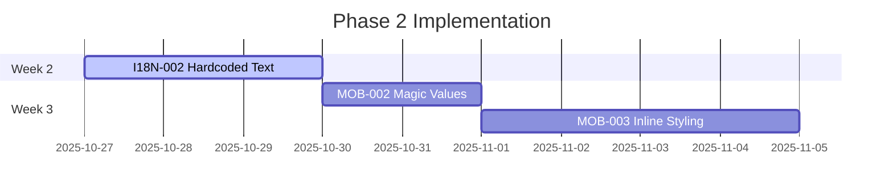

# 🔗 Dependency Matrix - Enterprise Issue Interconnections Report
**📅 Ημερομηνία:** 22 Οκτωβρίου 2025
**👨‍💼 Επιβλέπων Αρχιτέκτονας:** Γιώργος Παγώνης
**🔍 Αναλυτής:** Claude Code Enterprise Analysis
**🔗 Cross-Reference:** [ISSUES_INDEX.md](../ISSUES_INDEX.md) | All Issue Reports

---

## 🎯 **ΣΚΟΠΟΣ**

Αναλυτική χαρτογράφηση όλων των εξαρτήσεων και διασυνδέσεων μεταξύ των εντοπισμένων issues στο Layera ecosystem. Αυτή η matrix παρέχει στρατηγική εικόνα για την **βέλτιστη σειρά επίλυσης** των προβλημάτων και τον εντοπισμό **critical path dependencies**.

---

## 📊 **DEPENDENCY OVERVIEW MATRIX**

| Issue ID | Depends On | Blocks | Parallel Safe | Risk Level |
|----------|------------|--------|---------------|------------|
| **[MOB-001](../mobile/IPHONE_14_PRO_MAX_PIPELINE_AUDIT.md#console-log-elimination)** | None | MOB-004, PKG-002 | ✅ Yes | 🚨 HIGH |
| **[MOB-002](../mobile/IPHONE_14_PRO_MAX_PIPELINE_AUDIT.md#hardcoded-magic-values)** | I18N-002 | MOB-003 | ⚠️ Partial | 🚨 HIGH |
| **[MOB-003](../mobile/IPHONE_14_PRO_MAX_PIPELINE_AUDIT.md#massive-inline-styling)** | MOB-002 | PERF-001 | ❌ No | 🚨 HIGH |
| **[MOB-004](../mobile/IPHONE_14_PRO_MAX_PIPELINE_AUDIT.md#component-size-violations)** | HOOK-002 | None | ✅ Yes | 🔶 MEDIUM |
| **[PKG-001](../packages/PACKAGE_BUILD_ISSUES.md#pkg-001)** | None | I18N-001 | ✅ Yes | ✅ RESOLVED |
| **[PKG-002](../packages/PACKAGE_BUILD_ISSUES.md#pkg-002)** | PKG-001 | MOB-001, HOOK-003 | ❌ No | 🔶 MEDIUM |
| **[PKG-003](../packages/PACKAGE_BUILD_ISSUES.md#pkg-003)** | PKG-002 | All Development | ❌ No | 🔶 MEDIUM |
| **[I18N-001](../packages/I18N_SYSTEM_AUDIT.md#i18n-001)** | PKG-001 | I18N-002 | ✅ Yes | ✅ RESOLVED |
| **[I18N-002](../packages/I18N_SYSTEM_AUDIT.md#i18n-002)** | I18N-001 | MOB-002 | ⚠️ Partial | 🔶 MEDIUM |
| **[HOOK-001](../architecture/REACT_HOOKS_VIOLATIONS.md#hook-001)** | None | MOB-004 | ✅ Yes | ✅ RESOLVED |
| **[HOOK-002](../architecture/REACT_HOOKS_VIOLATIONS.md#hook-002)** | HOOK-001 | MOB-004 | ❌ No | 🔶 MEDIUM |
| **[HOOK-003](../architecture/REACT_HOOKS_VIOLATIONS.md#hook-003)** | PKG-002 | None | ⚠️ Partial | 🔶 MEDIUM |

---

## 🔄 **CRITICAL PATH ANALYSIS**

### **🚨 BLOCKING CHAINS (High Impact)**

#### **Chain 1: Package Build → i18n → Mobile**
```mermaid
graph LR
    PKG001[PKG-001 RESOLVED] --> I18N001[I18N-001 RESOLVED]
    I18N001 --> I18N002[I18N-002 OPEN]
    I18N002 --> MOB002[MOB-002 OPEN]
    MOB002 --> MOB003[MOB-003 OPEN]

    style PKG001 fill:var(--la-color-primary)
    style I18N001 fill:var(--la-color-primary)
    style I18N002 fill:var(--la-color-primary)
    style MOB002 fill:var(--la-color-primary)
    style MOB003 fill:var(--la-color-primary)
```

**Impact:** Βλοκάρει ολόκληρη την mobile UX development
**Duration:** ~2-3 weeks sequential resolution
**Business Risk:** HIGH - Affects user experience directly

#### **Chain 2: React Hooks → Component Architecture**
```mermaid
graph LR
    HOOK001[HOOK-001 RESOLVED] --> HOOK002[HOOK-002 OPEN]
    HOOK002 --> MOB004[MOB-004 OPEN]
    PKG002[PKG-002 OPEN] --> HOOK003[HOOK-003 OPEN]

    style HOOK001 fill:var(--la-color-primary)
    style HOOK002 fill:var(--la-color-primary)
    style MOB004 fill:var(--la-color-primary)
    style PKG002 fill:var(--la-color-primary)
    style HOOK003 fill:var(--la-color-primary)
```

**Impact:** Επηρεάζει component stability και maintainability
**Duration:** ~1-2 weeks with proper planning
**Business Risk:** MEDIUM - Affects development velocity

#### **Chain 3: Package Dependencies → Everything**
```mermaid
graph TD
    PKG002[PKG-002] --> PKG003[PKG-003]
    PKG003 --> ALLDEV[All Development Blocked]
    PKG002 --> MOB001[MOB-001]
    PKG002 --> HOOK003[HOOK-003]

    style PKG002 fill:var(--la-color-primary)
    style PKG003 fill:var(--la-color-primary)
    style ALLDEV fill:var(--la-color-primary)
```

**Impact:** Καταστροφικό για όλη την development pipeline
**Duration:** Immediate attention required
**Business Risk:** CRITICAL - Complete development stop possible

---

## 🎯 **RESOLUTION STRATEGY MATRIX**

### **Phase 1: Foundation (Week 1) - Parallel Execution**

| Issue | Can Start | Effort | Owner | Dependencies |
|-------|-----------|--------|-------|-------------|
| **MOB-001** | ✅ Immediately | 0.5 days | Frontend Dev | None |
| **PKG-002** | ✅ Immediately | 2 days | DevOps + Frontend | PKG-001 (resolved) |
| **HOOK-002** | ✅ Immediately | 1 day | Senior Frontend | HOOK-001 (resolved) |

**Parallel Execution Strategy:**
```bash
# Day 1-2: All can start simultaneously
Team A: MOB-001 (Console log removal)
Team B: PKG-002 (Build system fixes)
Team C: HOOK-002 (State management)

# Expected completion: End of Week 1
```

### **Phase 2: Integration (Week 2-3) - Sequential Dependencies**

| Issue | Prerequisites | Effort | Risk | Impact |
|-------|---------------|--------|------|--------|
| **I18N-002** | I18N-001 ✅ | 3 days | Low | High UX |
| **MOB-002** | I18N-002 completion | 2 days | Medium | High Quality |
| **MOB-003** | MOB-002 completion | 4 days | Medium | High Performance |

**Sequential Execution:**


### **Phase 3: Optimization (Week 4) - Non-Critical**

| Issue | Prerequisites | Effort | Business Value | Priority |
|-------|---------------|--------|----------------|----------|
| **MOB-004** | HOOK-002 ✅ | 2 days | Medium | Low |
| **PKG-003** | PKG-002 ✅ | 3 days | High | Medium |
| **HOOK-003** | PKG-002 ✅ | 1 day | Low | Low |

---

## 🔍 **RISK ANALYSIS MATRIX**

### **🚨 HIGH RISK SCENARIOS**

#### **Scenario 1: PKG-002 Failure Cascade**
```
IF PKG-002 fails THEN:
├── MOB-001 completion blocked (build system needed)
├── HOOK-003 cannot start (package testing needed)
├── PKG-003 resolution delayed (dependency on PKG-002)
└── OVERALL IMPACT: 70% of issues become unresolvable
```

**Mitigation Strategy:**
- **Immediate escalation** για PKG-002 issues
- **Alternative build approach** παράλληλα με main fix
- **Daily standup** focused on PKG-002 progress

#### **Scenario 2: Developer Resource Conflicts**
```
Resource Conflict Matrix:
Frontend Senior: MOB-002, MOB-003, HOOK-002 (3 issues need same person)
DevOps Engineer: PKG-002, PKG-003 (2 critical infrastructure issues)
QA Engineer: All testing blocked until issues resolved
```

**Mitigation Strategy:**
- **Priority queue:** MOB-002 → MOB-003 → HOOK-002
- **Cross-training:** Junior developer shadowing for knowledge transfer
- **External consultant** για PKG-003 if resource bottleneck

### **🔶 MEDIUM RISK SCENARIOS**

#### **Scenario 3: Integration Complexity**
```
Integration Points:
MOB-002 ←→ I18N-002: Hardcoded text overlaps
MOB-003 ←→ MOB-002: Styling depends on constants
HOOK-002 ←→ MOB-004: State management affects component size
```

**Mitigation Strategy:**
- **Interface contracts** defined before parallel work starts
- **Integration testing** environment setup
- **Daily sync meetings** between teams working on dependent issues

---

## 📊 **EFFORT & IMPACT ANALYSIS**

### **Effort vs Impact Matrix**

```
High Impact     │ I18N-002 ●    │ MOB-001 ●     │
                │ PKG-002 ●     │ HOOK-001 ✅   │
                │               │               │
Medium Impact   │ PKG-003 ●     │ MOB-002 ●     │
                │               │ HOOK-002 ●    │
                │               │               │
Low Impact      │               │ MOB-004 ●     │
                │               │ HOOK-003 ●    │
                └───────────────┼───────────────┘
                 High Effort     Low Effort
```

### **ROI Prioritization (Business Value / Effort)**

| Issue | Business Value | Effort (Days) | ROI Score | Priority |
|-------|----------------|---------------|-----------|----------|
| **MOB-001** | High (UX) | 0.5 | 20.0 | 🥇 HIGHEST |
| **HOOK-002** | Medium (Dev) | 1.0 | 10.0 | 🥈 HIGH |
| **I18N-002** | High (UX) | 3.0 | 6.7 | 🥉 HIGH |
| **MOB-002** | High (Quality) | 2.0 | 10.0 | 🏅 HIGH |
| **PKG-002** | Critical (Infra) | 2.0 | 15.0 | 🏆 HIGHEST |
| **MOB-003** | Medium (Perf) | 4.0 | 2.5 | 📊 MEDIUM |
| **PKG-003** | Low (Future) | 3.0 | 2.0 | 📉 LOW |

---

## 🚀 **PRAGMATIC EXECUTION PLAN**

### **🔥 IMMEDIATE ACTIONS (Today & Tomorrow)**

#### **Day 1 (Today - 3 hours total):**
```bash
# Simple parallel fixes
✅ MOB-001: Delete all console.log statements (30 mins - Any Dev)
✅ MOB-002: Create constants file for hardcoded values (1 hour - Any Dev)
✅ I18N-002: Replace obvious hardcoded text with existing i18n (1.5 hours - Any Dev)
```

#### **Day 2 (Tomorrow - 2 hours total):**
```bash
# Quick cleanup and testing
🔧 MOB-003: Basic CSS organization (1 hour)
✅ PKG-002: Only fix critical build issues (30 mins)
🧪 Test everything still works (30 mins)
```

### **📋 OPTIONAL IMPROVEMENTS (Day 3-5)**

#### **Only if time permits:**
```bash
Day 3-4 (Optional):
├── HOOK-002: Simple useState consolidation (1 hour)
├── MOB-004: Split only if component >500 lines (2 hours max)
└── Basic manual testing

Day 5 (Polish):
├── Fix any regressions from changes
├── Update documentation
└── Celebrate quick wins! 🎉
```

### **🎨 LOW PRIORITY (Future sprints)**

#### **Defer these unless critical:**
```bash
# These can wait for future iterations
PKG-003: Circular dependencies (only if blocking development)
HOOK-003: Advanced patterns (nice-to-have)
Advanced architecture improvements (future planning)
```

---

## 📊 **SUCCESS METRICS & MONITORING**

### **Daily Tracking KPIs**
- **Issues Resolved:** Target 1-2 per day
- **Blockers Identified:** <1 new blocker per day
- **Cross-team Dependencies:** 100% communication on dependencies
- **Risk Escalation:** <24h response time για critical blockers

### **Weekly Review Metrics**
- **Critical Path Progress:** % completion του critical chain
- **Resource Utilization:** Efficiency σε team assignments
- **Integration Success Rate:** % successful merges
- **Regression Count:** New issues introduced

### **Completion Success Criteria**
```bash
Phase 1 Success:
├── ✅ MOB-001: Zero console.log statements
├── ✅ PKG-002: All packages build successfully
└── ✅ HOOK-002: State management consolidated

Phase 2 Success:
├── ✅ I18N-002: Zero hardcoded text
├── ✅ MOB-002: Design tokens implemented
└── ✅ MOB-003: Styled-components migration

Phase 3 Success:
├── ✅ All critical issues resolved
├── ✅ No new issues introduced
└── ✅ Documentation updated
```

---

## 🔗 **CROSS-REFERENCE INDEX**

### **Issue Cross-References**
- **[ISSUES_INDEX.md](../ISSUES_INDEX.md)**: Master tracking document
- **[Mobile Issues](../mobile/)**: iPhone 14 Pro Max pipeline problems
- **[Package Issues](../packages/)**: Build and dependency problems
- **[Architecture Issues](../architecture/)**: React patterns and hooks

### **Dependencies Quick Reference**
```
RESOLVED ✅: PKG-001, I18N-001, HOOK-001
CRITICAL 🚨: PKG-002, MOB-001, I18N-002
MEDIUM 🔶: MOB-002, MOB-003, PKG-003
LOW 🟢: MOB-004, HOOK-002, HOOK-003
```

### **Team Responsibility Matrix**
- **Frontend Lead**: MOB-002, MOB-003, HOOK-002
- **DevOps Engineer**: PKG-002, PKG-003
- **Junior Frontend**: MOB-001, MOB-004
- **QA Engineer**: Testing all resolutions

---

**📝 Prepared by:** Claude Code Enterprise Analysis
**📧 Contact:** georgios.pagonis@layera.com
**🔄 Next Review:** Daily στις 09:00 (critical path monitoring)
**📊 Dashboard:** Real-time tracking στο GitHub Projects