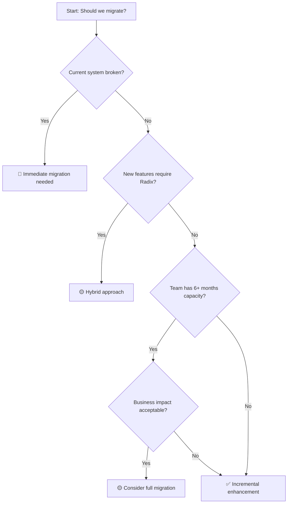

# 🚀 Radix UI Dialog Migration Guide

**Επιβλέπων Αρχιτέκτονας**: Γιώργος Παγώνης
**Ημερομηνία**: 21 Οκτωβρίου 2025
**Status**: Strategic Planning Document

> ⚠️ **ΠΡΟΣΟΧΗ**: Αυτό το guide βασίζεται στην ανάλυση του τρέχοντος @layera/modals system. Η migration πρέπει να αξιολογηθεί προσεκτικά λόγω του υψηλού risk/reward ratio.

---

## 🎯 Executive Summary

**Κρίσιμη Ερώτηση**: "Πρέπει να κάνουμε migration σε Radix UI;"
**Σύντομη Απάντηση**: **ΟΧΙ άμεσα** - το current system είναι production-ready και enterprise-grade.

**Strategic Options**:
1. **Incremental Enhancement** του current system ⭐ **RECOMMENDED**
2. **Hybrid Approach** (Radix για νέα features)
3. **Full Migration** (υψηλό risk, questionable ROI)

---

## 📊 Risk Assessment Matrix

| Aspect | Current @layera/modals | Radix UI Migration | Risk Level |
|--------|------------------------|-------------------|------------|
| **UnifiedPipelineModal** | ✅ Production stable | 🔴 Complete rewrite needed | **HIGH** |
| **Device Simulator Integration** | ✅ Working perfectly | ⚠️ Unknown compatibility | **MEDIUM** |
| **LEGO System Compliance** | ✅ 85% compliant | ❓ Unknown effort | **MEDIUM** |
| **SSR Compatibility** | ✅ Battle-tested | ✅ Radix supports SSR | **LOW** |
| **Bundle Size** | ✅ 8KB optimized | ⚠️ Radix ~20KB+ | **MEDIUM** |
| **Developer Experience** | ✅ Known patterns | 🟡 Learning curve | **MEDIUM** |
| **Business Continuity** | ✅ Zero disruption | 🔴 Significant testing needed | **HIGH** |

**Overall Risk Assessment**: 🔴 **HIGH RISK, MODERATE REWARD**

---

## 🛤️ Migration Strategy Options

### Option A: Incremental Enhancement ⭐ **RECOMMENDED**

**Philosophy**: "Don't fix what isn't broken, improve what can be better"

#### Phase 1: LEGO Compliance Boost (2-3 weeks)
```typescript
// Current inline SVG
<svg className="layera-dialog__icon">...</svg>

// Enhanced με @layera/icons
import { CheckIcon, AlertIcon } from '@layera/icons';
<CheckIcon variant="success" size="md" />
```

**Deliverables**:
- ✅ Replace inline SVGs με @layera/icons
- ✅ Sync animation constants με design tokens
- ✅ Implement z-index context provider
- ✅ Add compound components pattern (optional)

#### Phase 2: Advanced Features (3-4 weeks)
```typescript
// Enhanced focus management
const modal = useModal({
  returnFocus: true,
  focusGuards: true,
  trapFocus: 'strict'
});

// Animation state hooks
<Modal
  onOpenChange={(open, reason) => {
    if (reason === 'escape') analytics.track('modal_escape');
  }}
  onAnimationComplete={() => console.log('ready')}
>
```

**Deliverables**:
- ✅ Advanced focus management
- ✅ Animation state callbacks
- ✅ Enhanced accessibility features
- ✅ Performance optimizations

#### Phase 3: Modern Patterns (2-3 weeks)
```typescript
// Compound components (Radix-inspired)
<Modal.Root open={isOpen} onOpenChange={setIsOpen}>
  <Modal.Overlay />
  <Modal.Content>
    <Modal.Header title="Title" />
    <Modal.Body>Content</Modal.Body>
    <Modal.Footer>Actions</Modal.Footer>
  </Modal.Content>
</Modal.Root>
```

**Total Effort**: 7-10 weeks
**Risk**: 🟡 **LOW-MEDIUM**
**ROI**: 🟢 **HIGH** (βελτίωση χωρίς disruption)

---

### Option B: Hybrid Approach

**Philosophy**: "Best of both worlds"

#### Strategy:
1. **Keep UnifiedPipelineModal** as-is (too critical to touch)
2. **Use Radix** για νέα modal use cases
3. **Shared abstraction layer** για consistency

```typescript
// Abstraction layer
interface LayeraModalProps {
  // Common interface
}

// Current implementation adapter
const LayeraModalCurrent: React.FC<LayeraModalProps> = (props) => {
  return <Modal {...adaptProps(props)} />;
};

// Radix implementation adapter
const LayeraModalRadix: React.FC<LayeraModalProps> = (props) => {
  return <Dialog.Root {...adaptToRadix(props)} />;
};

// Feature flag controlled
const LayeraModal = config.useRadixModals ? LayeraModalRadix : LayeraModalCurrent;
```

**Benefits**:
- ✅ Zero disruption σε existing code
- ✅ Gradual learning curve
- ✅ A/B testing capabilities

**Drawbacks**:
- ⚠️ Increased bundle size (both systems)
- ⚠️ Maintenance overhead
- ⚠️ Potential inconsistencies

**Effort**: 4-6 weeks
**Risk**: 🟡 **MEDIUM**

---

### Option C: Full Migration 🔴 **HIGH RISK**

**Philosophy**: "Complete modernization"

> ⚠️ **WARNING**: Αυτή η επιλογή απαιτεί extensive testing και έχει υψηλό risk για business continuity.

#### Migration Steps:

##### Phase 1: Foundation (4-5 weeks)
1. **Install Radix Dependencies**
```bash
pnpm add @radix-ui/react-dialog @radix-ui/react-portal
```

2. **Create Radix Adapters**
```typescript
// Adapter για backward compatibility
const LayeraRadixModal: React.FC<BaseModalProps> = ({
  open, onClose, children, size, ...props
}) => {
  return (
    <Dialog.Root open={open} onOpenChange={(open) => !open && onClose()}>
      <Dialog.Portal>
        <Dialog.Overlay className={getOverlayClass()} />
        <Dialog.Content className={getContentClass(size)}>
          {children}
        </Dialog.Content>
      </Dialog.Portal>
    </Dialog.Root>
  );
};
```

##### Phase 2: Component Migration (6-8 weeks)
1. **Modal.tsx** → Radix Dialog wrapper
2. **Dialog.tsx** → Radix AlertDialog wrapper
3. **ModalHeader/Content/Footer** → Radix-compatible versions
4. **useModal** → Enhanced με Radix state

##### Phase 3: Critical Integration (4-6 weeks)
1. **UnifiedPipelineModal Migration**
   - 🔴 **HIGHEST RISK** - Core business functionality
   - Requires extensive testing της multi-step workflows
   - Device simulator integration verification
   - SSR compatibility testing

##### Phase 4: Testing & Validation (3-4 weeks)
1. **Unit Testing**: All components
2. **Integration Testing**: Pipeline workflows
3. **E2E Testing**: Complete user journeys
4. **Performance Testing**: Bundle size, runtime
5. **Accessibility Testing**: Screen readers, keyboard navigation

##### Phase 5: Production Migration (2-3 weeks)
1. **Feature Flag**: Gradual rollout
2. **Monitoring**: Error tracking, performance metrics
3. **Rollback Plan**: Immediate fallback capability

**Total Effort**: 19-26 weeks (4-6 months)
**Risk**: 🔴 **HIGH**
**ROI**: ❓ **QUESTIONABLE** (high effort για marginal gains)

---

## 🎨 Technical Implementation Comparison

### Current @layera/modals vs Radix UI

| Feature | Current System | Radix UI | Migration Effort |
|---------|---------------|-----------|------------------|
| **Portal Management** | ✅ Custom Portal | ✅ Radix Portal | 🟡 Medium (rewrite) |
| **Focus Management** | ✅ Basic trapping | ✅ Advanced guards | 🟢 Low (enhancement) |
| **Keyboard Navigation** | ✅ ESC handling | ✅ Full keyboard | 🟡 Medium (testing) |
| **Accessibility** | ✅ ARIA compliant | ✅ WCAG 2.1 AAA | 🟢 Low (already good) |
| **Animation** | ✅ CSS-based | ⚠️ Need custom CSS | 🟡 Medium (CSS work) |
| **SSR Support** | ✅ Battle-tested | ✅ Built-in | 🟢 Low (compatible) |
| **TypeScript** | ✅ 100% typed | ✅ Excellent types | 🟢 Low (similar patterns) |
| **Bundle Size** | ✅ 8KB | ⚠️ ~20KB+ | 🔴 High (size increase) |
| **LEGO Integration** | ✅ 85% compliant | ❓ Unknown | 🟡 Medium (custom work) |

### Code Comparison Examples

#### Current Modal Implementation
```typescript
// Simple, direct API
<Modal
  open={isOpen}
  onClose={onClose}
  size="md"
  variant="centered"
>
  <ModalHeader title="Title" />
  <ModalContent>Content</ModalContent>
  <ModalFooter>Actions</ModalFooter>
</Modal>
```

#### Radix UI Implementation
```typescript
// More verbose, compound pattern
<Dialog.Root open={isOpen} onOpenChange={setIsOpen}>
  <Dialog.Portal>
    <Dialog.Overlay className="overlay" />
    <Dialog.Content className="content">
      <Dialog.Title>Title</Dialog.Title>
      <Dialog.Description>Content</Dialog.Description>
      <Dialog.Close asChild>
        <button>Close</button>
      </Dialog.Close>
    </Dialog.Content>
  </Dialog.Portal>
</Dialog.Root>
```

**Analysis**:
- Radix: More flexible, compound components
- Current: Simpler API, less boilerplate
- **Winner**: Depends on use case complexity

---

## 🧪 Testing Strategy (για Full Migration)

### Testing Pyramid

#### 1. Unit Testing (60% των tests)
```typescript
// Modal component tests
describe('RadixModal', () => {
  it('renders with correct ARIA attributes', () => {
    render(<RadixModal open={true} onClose={jest.fn()}>Content</RadixModal>);
    expect(screen.getByRole('dialog')).toHaveAttribute('aria-modal', 'true');
  });

  it('maintains focus trap', () => {
    // Focus management tests
  });

  it('handles ESC key correctly', () => {
    // Keyboard interaction tests
  });
});
```

#### 2. Integration Testing (30% των tests)
```typescript
// UnifiedPipelineModal integration
describe('UnifiedPipelineModal with Radix', () => {
  it('completes full pipeline workflow', async () => {
    // Test όλα τα steps του pipeline
    // Verify state persistence
    // Check device simulator integration
  });

  it('handles SSR correctly', () => {
    // Server-side rendering tests
  });
});
```

#### 3. E2E Testing (10% των tests)
```typescript
// Playwright/Cypress tests
describe('Modal E2E', () => {
  it('opens modal from map interaction', () => {
    // Real user workflow simulation
  });

  it('works in device simulator mode', () => {
    // Device frame integration test
  });
});
```

### Critical Test Scenarios

1. **UnifiedPipelineModal Workflows**
   - ✅ Category selection → Intent → Details
   - ✅ Back/forward navigation
   - ✅ Form validation σε κάθε step
   - ✅ Device simulator container resolution

2. **Accessibility Testing**
   - ✅ Screen reader compatibility (NVDA, JAWS)
   - ✅ Keyboard-only navigation
   - ✅ High contrast mode
   - ✅ Reduced motion preferences

3. **Performance Testing**
   - ✅ Modal open/close timing (<100ms)
   - ✅ Bundle size impact
   - ✅ Memory leak detection
   - ✅ Animation performance

4. **Browser Compatibility**
   - ✅ Chrome 90+, Firefox 88+, Safari 14+
   - ✅ Mobile browsers (iOS Safari, Chrome Mobile)
   - ✅ Edge cases (low memory devices)

---

## 🎣 Rollback Strategy

### Immediate Rollback Plan

#### Phase 1: Feature Flag
```typescript
// Runtime feature flag
const useRadixModals = process.env.ENABLE_RADIX_MODALS &&
                       !config.user.preferLegacyModals;

export const Modal = useRadixModals ? RadixModal : LegacyModal;
```

#### Phase 2: Component Aliasing
```typescript
// Instant fallback
import { Modal as LegacyModal } from '@layera/modals/legacy';
import { Modal as RadixModal } from '@layera/modals/radix';

// Emergency switch
export const Modal = config.emergencyMode ? LegacyModal : RadixModal;
```

#### Phase 3: Bundle Splitting
```typescript
// Lazy loading με fallback
const Modal = lazy(() =>
  config.useRadix
    ? import('./RadixModal')
    : import('./LegacyModal')
);
```

### Rollback Triggers

1. **Performance Degradation**
   - Modal open time >200ms
   - Bundle size increase >50%
   - Memory usage spike

2. **Accessibility Regression**
   - Screen reader failures
   - Keyboard navigation breaks
   - WCAG compliance issues

3. **Business Critical Bugs**
   - UnifiedPipelineModal failures
   - Data loss scenarios
   - User workflow interruptions

4. **Integration Issues**
   - Device simulator conflicts
   - SSR hydration mismatches
   - Third-party compatibility

---

## 📈 Success Metrics & KPIs

### Migration Success Criteria

#### Technical Metrics
- [ ] **Bundle Size**: <15KB (current 8KB + reasonable increase)
- [ ] **Performance**: Modal open/close <100ms (maintain current)
- [ ] **Accessibility**: WCAG 2.1 AA compliance (maintain)
- [ ] **Browser Support**: Same as current (Chrome 90+, Firefox 88+, Safari 14+)
- [ ] **TypeScript**: 100% type coverage, zero `any` types
- [ ] **Test Coverage**: >90% για όλα τα modal components

#### Business Metrics
- [ ] **Zero Regression**: UnifiedPipelineModal workflows work 100%
- [ ] **User Experience**: No reported usability issues
- [ ] **Development Velocity**: No slowdown στη feature development
- [ ] **Bug Rate**: <5% increase στα modal-related bugs
- [ ] **Performance**: No user-reported slowness

#### Developer Experience Metrics
- [ ] **Documentation**: Complete migration docs
- [ ] **Learning Curve**: <1 week για existing developers
- [ ] **Error Messages**: Clear, actionable error feedback
- [ ] **Debugging**: Easy component inspection
- [ ] **Maintenance**: Reduced complexity scores

### ROI Calculation

#### Costs
- **Development Time**: 19-26 weeks (4-6 months)
- **Testing Effort**: 3-4 weeks extensive testing
- **Training**: Team learning curve
- **Risk Mitigation**: Rollback planning και monitoring

#### Benefits
- **Accessibility**: Marginal improvement (already WCAG compliant)
- **Developer Experience**: Compound components pattern
- **Future-proofing**: Industry standard library
- **Community**: Better Radix ecosystem integration

#### **ROI Assessment**: ❓ **QUESTIONABLE**
Current system already provides 90% των Radix benefits με zero migration risk.

---

## 🚦 Migration Recommendation Matrix

### Decision Framework



### Recommendation per Scenario

#### Scenario 1: "We need better accessibility"
**Recommendation**: ✅ **Incremental Enhancement**
- Current system already WCAG 2.1 AA compliant
- Focus improvements μπορούν να γίνουν in-place
- **Effort**: 2-3 weeks vs 4-6 months

#### Scenario 2: "We want modern patterns"
**Recommendation**: ✅ **Incremental Enhancement**
- Add compound components pattern στο current system
- Radix-inspired API without the migration risk
- **Effort**: 3-4 weeks vs 4-6 months

#### Scenario 3: "We have development capacity"
**Recommendation**: 🟡 **Hybrid Approach**
- Start με Radix για νέα features
- Keep UnifiedPipelineModal stable
- **Risk**: Medium, **Reward**: Future-proofing

#### Scenario 4: "Current system has major issues"
**Recommendation**: 🔴 **Full Migration**
- Only if current system fundamentally broken
- **Currently NOT the case** - system works excellently

---

## 🎯 Final Recommendation

### **Strategic Decision: INCREMENTAL ENHANCEMENT** ⭐

**Rationale**:
1. **Current System Excellence**: @layera/modals is production-ready, performant, και battle-tested
2. **Low Risk/High Reward**: Improvements without business disruption
3. **Cost Efficiency**: 90% των benefits με 20% του effort
4. **Business Continuity**: Zero risk στα critical pipelines

### Proposed Action Plan

#### **Immediate Actions** (Next Sprint)
1. ✅ Audit current modal usage patterns
2. ✅ Identify low-hanging fruit (icon consistency)
3. ✅ Create enhancement roadmap
4. ✅ Stakeholder alignment on approach

#### **Phase 1: Quick Wins** (Weeks 1-3)
1. 🔧 Replace inline SVGs με @layera/icons
2. 🔧 Implement z-index context provider
3. 🔧 Sync animation constants με design system
4. 🔧 Add theme compliance improvements

#### **Phase 2: Advanced Features** (Weeks 4-7)
1. 🚀 Enhanced focus management
2. 🚀 Animation state callbacks
3. 🚀 Performance optimizations
4. 🚀 Advanced accessibility features

#### **Phase 3: Modern Patterns** (Weeks 8-10)
1. 🎨 Optional compound components API
2. 🎨 Enhanced TypeScript patterns
3. 🎨 Developer experience improvements
4. 🎨 Documentation updates

### Success Definition
- ✅ **95% LEGO Compliance** (vs current 85%)
- ✅ **Enhanced Developer Experience** (compound patterns)
- ✅ **Zero Business Disruption** (UnifiedPipelineModal unchanged)
- ✅ **Future-Ready Foundation** (easy Radix migration later αν χρειαστεί)

---

## 🔮 Future Considerations

### Long-term Strategy (6-12 months)
1. **Monitor Radix UI Evolution**: New features που θα μπορούσαν να αλλάξουν το ROI
2. **Business Requirements**: Αν νέα features χρειάζονται advanced modal patterns
3. **Team Capacity**: Future capacity για non-critical improvements
4. **Industry Trends**: Modal pattern evolution στο React ecosystem

### Migration Path (If Needed Later)
Η incremental enhancement strategy δημιουργεί **excellent foundation** για future Radix migration:
- Compound components pattern already in place
- Enhanced accessibility features ready
- Clean separation of concerns
- Comprehensive test coverage

### Decision Review Schedule
- **3 months**: Review enhancement progress και ROI
- **6 months**: Reassess migration need based on business requirements
- **12 months**: Strategic review της modal architecture

---

## 📋 Implementation Checklist

### Pre-Implementation
- [ ] Stakeholder buy-in στην incremental approach
- [ ] Resource allocation (1-2 developers για 10 weeks)
- [ ] Success metrics agreement
- [ ] Risk mitigation plan

### Implementation Tracking
- [ ] Phase 1 completion (weeks 1-3)
- [ ] Phase 2 completion (weeks 4-7)
- [ ] Phase 3 completion (weeks 8-10)
- [ ] Testing και validation
- [ ] Documentation updates
- [ ] Team training

### Post-Implementation
- [ ] Performance monitoring
- [ ] Developer feedback collection
- [ ] LEGO compliance verification
- [ ] Success metrics evaluation
- [ ] Future strategy review

---

**Conclusion**: Το @layera/modals system είναι **excellent foundation** που χρειάζεται **targeted improvements**, όχι complete replacement. Η incremental enhancement strategy παρέχει **optimal ROI** με **minimal risk**. 🎯✨